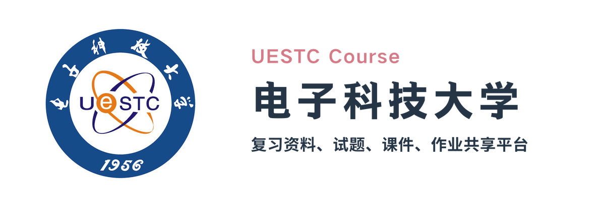

# 介绍

...

# 内容

介绍本仓库所有资源的内容形式、组织结构等

# 使用

介绍如何使用（查找、下载等）本仓库

# 贡献

介绍如何给本仓库进行贡献，可附一个具体的教程 .md 文件超链接

可以再附加一个资源撰写规范

## 贡献者名单

一个简要介绍，及一个 .md 文件超链接，该文件包含具体的贡献者名单

# 声明

各种法律、版权、免责等声明

## 版权声明

This repository contains the course materials of University of Electronic Science and Technology of China.

本仓库包含了电子科技大学所开设的各种课程的各种信息。

I'am preparing the detailed contents, e.g., how to make version contral, how to define format, etc. If you are interested or have any questions, please to contact me at xovee@live.com.

我正在准备具体的内容，例如知识版权保护、隐私问题、格式问题等等，如果你对本仓库感兴趣，或者有任何问题，欢迎与我联系：xovee@live.com
