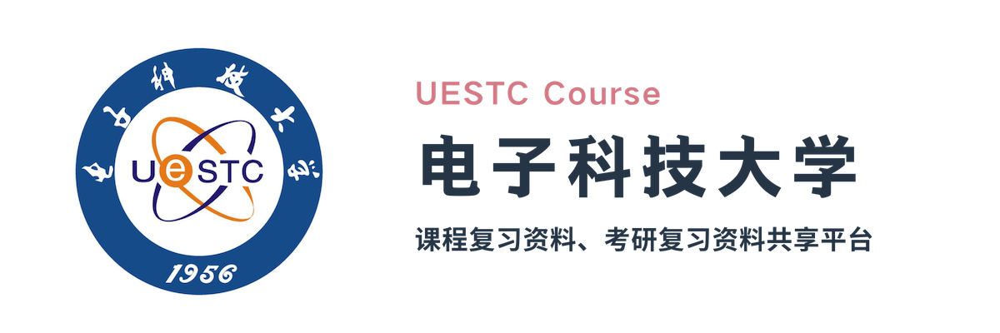

# 介绍

...

- [ ] 仓库的运作模式

# 内容

本仓库旨在为成电学生提供一个在线资源分享平台，秉承开源、免费、共享的理念，任何人都可以为仓库的资源做出贡献。仓库内容包括电子科技大学的各类课程资料和考研资料等。下面对仓库所包含的内容作一简要介绍：

## 课程目录

该目录的内容为电子科技大学所开设的各类课程，以一个课程一个文件夹为组织方式；课程文件夹下划分“复习资料”、“历年试题”、“作业”、“教材课件”等几个部分。

## 考研目录

该目录的内容为全国硕士研究生统一招生考试（初试及复试等）的各类复习资料、录取情况、经验心得等；由于电子科技大学为34所自主划线院校之一，故以[电子科技大学2019年硕士研究生招生考试初试科目考试大纲](https://yz.uestc.edu.cn/d/file/zhaoshengzhuanti/20180926/%E7%94%B5%E5%AD%90%E7%A7%91%E6%8A%80%E5%A4%A7%E5%AD%A62019%E5%B9%B4%E7%A1%95%E5%A3%AB%E7%A0%94%E7%A9%B6%E7%94%9F%E6%8B%9B%E7%94%9F%E8%80%83%E8%AF%95%E5%88%9D%E8%AF%95%E7%A7%91%E7%9B%AE%E8%80%83%E8%AF%95%E5%A4%A7%E7%BA%B2.pdf)所划分的考试科目为依据（例如820计算机专业基础）来组织目录结构。

## 具体示例
- 课程目录
  - C 语言
    - 复习资料
    - 历年试题
    - 作业
  - 比较文学
    - 复习资料
    - 教材课件
- 考研目录
  - 经济与管理学院
  - 信息与软件工程学院
    - C 语言
    - 面试
  - 631公共管理
  - 860软件工程学科基础综合
    - 计算机网络
    - 软件工程

# 使用

介绍如何使用（查找、下载等）本仓库

# 贡献

介绍如何给本仓库进行贡献，可附一个具体的教程 .md 文件超链接

可以再附加一个资源撰写规范

## 贡献者名单

一个简要介绍，及一个 .md 文件超链接，该文件包含具体的贡献者名单

# 声明

各种法律、版权、免责等声明

## 版权声明

This repository contains the course materials of University of Electronic Science and Technology of China.

本仓库包含了电子科技大学所开设的各种课程的各种信息。

I'am preparing the detailed contents, e.g., how to make version contral, how to define format, etc. If you are interested or have any questions, please to contact me at xovee@live.com.

我正在准备具体的内容，例如知识版权保护、隐私问题、格式问题等等，如果你对本仓库感兴趣，或者有任何问题，欢迎与我联系：xovee@live.com
