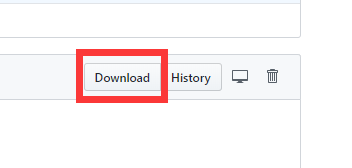
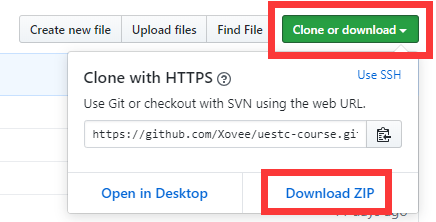

# 使用指南

## 浏览器搜索

使用浏览器进入仓库首页之后，点击 **课程目录** ，然后使用 `Ctrl+F` 快捷键进行搜索，键入你想寻找的 [课程名]，例如 *微积分*，或 *软件工程*，然后即可定位所有匹配的文件夹。


## 文件查找

使用浏览器进入仓库首页之后，按下快捷键 `t`，进入文件搜索模式，输入你想要寻找的文件名或者文件夹名，即可实时展示搜索结果。


## 资源下载

下载仓库中资源的方式有很多种，

**如果要下载某个文件夹中的资源**，请直接点击文件夹主页中所提供的下载链接，如下图所示：


> 链接下载文件夹的功能是由我们定制的 [gitzip](https://xovee.github.io/gitzip/) 实现，并非 GitHub 官方提供，如若因 GitHub API 访问限制的缘故而无法成功下载文件夹的话，请使用替代方案：（1）KinoLien 开发的 [gitzip](https://kinolien.github.io/gitzip/)；（2）Minhas Kamal 开发的 [DownGit](https://minhaskamal.github.io/DownGit/#/home)；（3）zhoudaxiaa 开发的 [DownGit](http://downgit.zhoudaxiaa.com/#/home)。

**如果要下载某个单独的文件**，点击该文件，然后点击右上角的 `Download` 按钮即可下载。



**如果要下载整个仓库的所有文件**，首先进入仓库主页，点击右上角的 `Clone or download`，然后点击 `Download ZIP`，即可下载整个仓库。由于仓库内容繁多，所占空间巨大，如果您不是贡献者，则无必要下载整个仓库，只选择您需要下载的文件夹即可。如果您打算使用命令行克隆仓库，请查阅 GitHub [克隆仓库的官方帮助文档（英文）](https://help.github.com/en/articles/cloning-a-repository)。如果你本地有安装`Git`，可以使用如下代码下载仓库：
```shell
git clone https://github.com/Xovee/uestc-course.git --depth=1
```



如果您打算为仓库做出贡献，请阅读[贡献指南](./贡献指南.md)。

### Issue

您可以使用 Issue 来反馈建议、提交问题，甚至还可以进行资源贡献。

进入仓库首页，点击 Issue 选项卡，点击 `New issue` 按钮，选择一个 Issue 模板，填写具体的 Issue 内容。


如果您对任何使用流程存有困惑，或者对使用流程有改进意见等，请提交 Issue，

或者发邮件与我们联系：xovee at ieee.org
