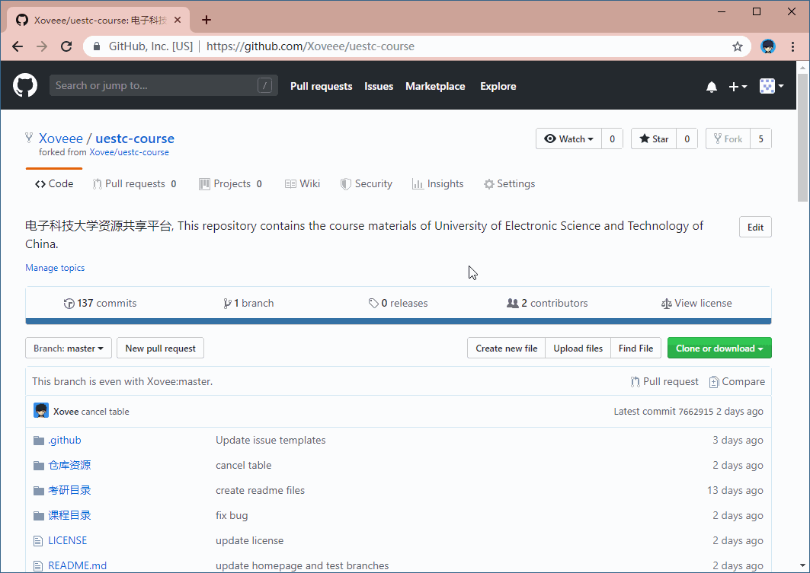
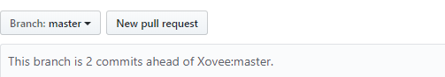
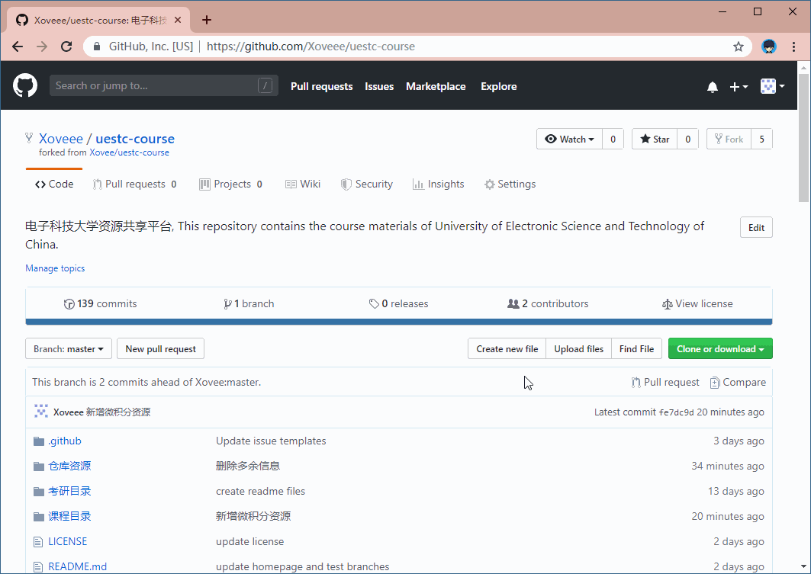

**首先感谢各位有意为仓库做出贡献的贡献者们，仓库之建设苟非一日能成，亦非一二人为之；所谓“九层之台，起于垒土；千里之行，始于足下”，仓库资源若能积少成多、由简至臻，全凭各位贡献者的无私劳动，没有你们，便不可能有仓库的未来。:heart::heart::heart:**

# 贡献指南目录

- 贡献的途径
  - 新增资源
  - 完善资源
  - 提出改进意见
  - 加入仓库项目组
- 贡献的规范
  - 文件名规范
  - README.md 文件规范
- 贡献的方法及详细步骤
  - Email、Issue
  - Pull Request

## 贡献的途径

### 新增资源

**资源范围**：仓库当前所规划的资源类型包括：（1）课程复习资料；（2）考研复习资料。

课程复习资料主要包含以下四种类型：

- **复习资料**：包括但不限于各种复习重点、复习心得等复习资料
- **历年试题**：包括但不限于各种期末考试、期中考试等考试资料
- **作业**：包括但不限于各种课堂作业、课后作业等作业资料
- **教材**：一般不直接上传教材资源，而是只列举该门课程所推荐教材信息，仅供读者参考，以便读者后续进行教材的借阅、购买等行为；对于已经绝版的资源，或者其销售价格明显超出合理范围的资源，则不受此限

还有一些特殊情况：

- **视频类资源**：直接提供资源链接地址
- **声明不允许转载的资源**：直接提供原资源链接地址
- **单个文件大小超过 100 MB 的资源**：对于占用空间过大的资源，建议上传至其他网盘，然后在仓库中提供链接
- **课件类资源**：由于课件不属于学生难以获取的资源，故在未经著作人许可的情况下，一般情况不直接上传课件资源

此外，应避免以下问题：

**隐私问题**：各位贡献者所上传的资料中，应避免包含各类隐私信息，例如电话号码、家庭住址等个人信息。

**主观评价问题**：各位贡献者所上传的资料中，应避免包含各类主观评价问题，包括对课程的评价、老师的评价等。

**版权问题**：请具体参阅[版权声明](./版权声明.md)、[仓库协议](../LICENSE)、[免责声明](./免责声明.md)和[侵权处理](./侵权处理.md)等文件。对版权问题有兴趣的读者，欢迎参阅[版权讨论](./版权讨论.md)文件。

**违规问题**：请各位贡献者务必不要上传无关资源，包括但不限于以下情形：

1. 违反宪法或法律法规规定的；
2. 危害国家安全，泄露国家机密，颠覆国家政权，破坏国家统一的；
3. 损害国家荣誉和利益的，损害公共利益的；
4. 煽动民族仇恨、民族歧视，破坏民族团结的；
5. 破坏国家宗教政策，宣扬邪教和宗教迷信的；
6. 散步谣言，扰乱社会秩序，破坏社会稳定的；
7. 散步淫秽、色情、赌博、暴力、凶杀、恐怖或者教唆犯罪的；
8. 侮辱或者诽谤他人，侵害他人合法权益的；
9. 含有法律、行政法规禁止的其他内容的。

### 完善资源

请读者到仓库的 **[Projects](https://github.com/Xovee/uestc-course/projects)** 页面，或者查阅[**资源完善计划**](./资源完善计划.md)查看当前仓库所需要完善的内容。

### 提出改进意见

除了为仓库贡献或改善资源，您还可以为仓库提出改进意见，包括但不限于仓库的各种组织架构、设计细节等问题。您可以通过提交 Issue，提交 Pull Request，或者通过邮件（xovee@ieee.org）来提出改进意见。

## 贡献的规范

对于资源文件名，请参考以下规范：

复习资料|历年试题|作业
---|---|---
不作规范，由贡献者自行命名。|`[考试时间]-[考试类型]-[有无答案]` 2019年春-期末考试-有答案 2018年秋-期中考试-无答案 时间不明-课堂考试-无答案|`[布置时间]-[作业类型]` 2019年春-课后作业 2018年秋-课堂作业-1 2018年秋-课堂作业-2|

在每一个课程目录及相应的资源类型文件夹之中，都有一个 README.md 文件，用于描述该文件夹内资源的详细信息。如果读者对 Markdown 文件的语法还不熟悉，我们建议您阅读这两篇教程：

- [Mastering Markdown](https://guides.github.com/features/mastering-markdown/)
- [Markdown 语法说明（简体中文版）](https://www.appinn.com/markdown/)

关于 README.md 的具体规范，请[参阅该文件](./模板/README.md)，里面有各类资源 README.md 的模板，贡献者可以按需复制。

## 贡献的方法及详细步骤

### Email、Issue

GitHub 原为代码托管网站，对于不熟悉 GitHub 工作流程的读者来说，学习成本可能略高。如若读者熟悉 GitHub 的工作流程，我们推荐贡献者使用 `Fork + Pull Request` 的方式来进行贡献；对于其他情况，我们建议贡献者使用 Email 或者 Issue 的方式进行贡献。

贡献的步骤如下：

1. 检查您要贡献的资源是否已经存在，是否符合仓库收录的范围
2. 检查资源有无隐私内容、违规内容、版权问题等
3. 下载 [Excel 表格](https://github.com/Xovee/uestc-course/raw/master/%E4%BB%93%E5%BA%93%E8%B5%84%E6%BA%90/%E8%B5%84%E6%BA%90%E4%BF%A1%E6%81%AF%E8%A1%A8.xlsx)，填写资源信息
4. 使用 Email 或者 Issue 把资源和表格发送给我们（建议压缩为 ZIP 文件）

Email 地址：xovee@ieee.org

Issue 的使用方法（需要登录 GitHub 账号）：

1. 进入仓库首页
2. 点击仓库名 `uestc-course` 下的 `Issues` 选项卡
3. 点击 `New Issue` 按钮
4. 选择资源贡献 `Issue` 模板
5. 填写 `Issue` 内容，上传资源文件，点击 `Submit new issue` 按钮即可

### Pull Request

除了使用 Email 和 Issue，贡献者们亦可以使用 Pull Request 为仓库添加、修改、或删除内容。Email 和 Issue 的原理是，贡献者将资源发送给仓库的维护者，然后维护者再将资源应用到仓库中；而 Pull Request 则是贡献者直接对仓库进行改动，进行各种操作，在改动完成后，向仓库提交 Pull Request；仓库的维护者然后会对 Pull Request 进行审核，审核通过后，将 Pull Request 中的改动，合并到仓库之中。

由于 Pull Request 的使用门槛较高，故对于不熟悉 GitHub 工作流程的贡献者，我们推荐您使用 Email 和 Issue 来进行贡献。如果您熟悉 GitHub 的各种操作，那就请直接提交 Pull Request 吧！如果您想学习 GitHub 的工作流程，我们推荐您阅读 [GitHub 指南（英文）](https://guides.github.com/)，尤其是以下四篇指南：（1）[理解 GitHub 工作流程](https://guides.github.com/introduction/flow/)；（2）[Hellow World](https://guides.github.com/activities/hello-world/)；（3）[Git 手册](https://guides.github.com/introduction/git-handbook/)；（4）[Forking 项目](https://guides.github.com/activities/forking/)。更详细的帮助手册请参阅 [GitHub Help（英文）](https://help.github.com/en)。中文教程比较著名的有廖雪峰所写的 [Git 教程](https://www.liaoxuefeng.com/wiki/896043488029600)。

不过我们提供了 Pull Request 的简易教程，按照以下步骤，就可以轻松创建 Pull Request 啦！

步骤|示例
---|---
我们首先要做的就是 Fork 仓库，点击仓库首页右上角的 `Fork` 按钮。|
`"This branch is even tiwh Xovee:master"`  代表您 Fork 的仓库与源仓库是完全相同的。|
然后就可以对您 Fork 的仓库做各种改动， 例如修改 README.md 文件；修改完成后， 点击  按钮提交 `Commit`。  README.md 文件的填写规范请参阅 [README.md 文件模板](./模板/README.md).|
您也可以上传文件或者文件夹， 进入您想要上传资源的目录， 点击右上角的 `Upload files` 按钮， 选择或者拖动文件/文件夹到网页中间的框内，然后提交 `Commit`。|
假如您对 Fork 的仓库提交了两次 `Commit`， `This branch is 2 commits ahead of Xovee:master` 表示当前分支比源仓库领先 `2` 个提交。|
回到仓库首页，点击状态条右侧的  `Pull Request` 按钮或者 `Compare` 按钮，即可查看您所做出的改动，然后点击  按钮。|

然后源仓库就会收到您的 `Pull Request`，在仓库维护者审核之后，就会合并您的改动到源仓库之中。您可以在源仓库中查看您自己或者其他人提交的 Issues 或者 Pull Requests。教程就到这里啦，如果您有任何疑问，欢迎提交 Issue 参与讨论。

**再次感谢各位贡献者们，:heart::heart::heart:**
