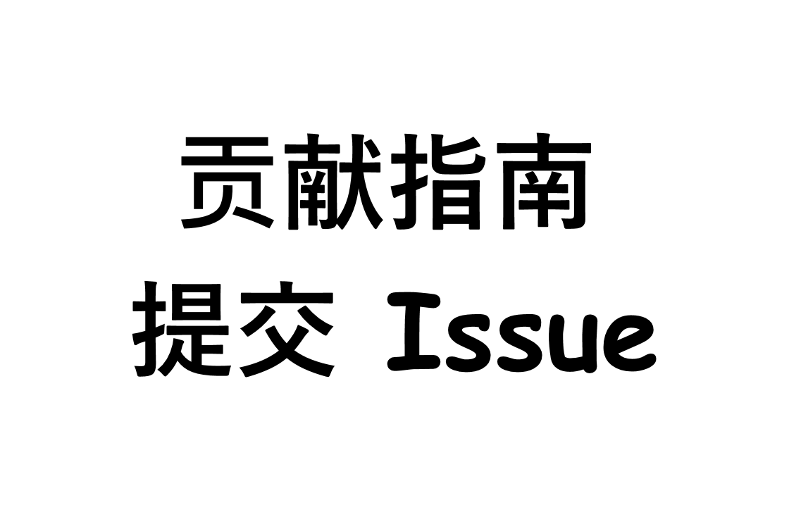

# 贡献指南

感谢你帮助完善 UESTC Course。最方便的方式是创建“资源贡献” Issue 并上传文件；也可发邮件到 `xovee at uestc.edu.cn`，或通过 Pull Request 提交。

## 可以贡献什么

仓库收录电子科技大学课程资料及研究生入学考试相关资料，常用分类如下：

| 分类 | 内容示例 |
| --- | --- |
| 复习资料 | 复习提纲、学习笔记、知识总结、练习资料 |
| 历年试题 | 期中、期末等试题，回忆版及答案须说明性质 |
| 作业 | 课堂或课后作业、实验要求、可公开的报告示例 |
| 教材信息 | 书名、作者、版本等参考信息或合法公开链接；具体展示方式由维护者确认 |

上传前请阅读[仓库协议](仓库协议.md)和[版权声明](版权声明.md)。声明不得转载的资料、未经许可公开的课件、版权或隐私情况不明的内容，应先说明情况，不直接上传。教材绝版或价格较高本身不代表可以公开传播。

视频类资源及超过 100 MB 的单文件优先提供合法公开来源链接。外部链接同样需符合收录标准，不能用网盘链接绕过隐私或转载限制。

## 需要提供的信息

知道多少写多少，未知项留空；不要为了填满表格猜测信息。

- 课程全名或考研科目，建议分类。
- 资料说明；年份、学期、考试类型、是否含答案及答案来源。
- 作者、教师、来源或原始链接。
- 回忆版、缺页、不完整、非官方答案等情况。
- 转载授权、使用限制及需要维护者先确认的问题。

文件正文与描述不一致时，请说明差异。维护者会核对内容、文件名和 README，上传不代表已经收录。

## 通过 Issue 或邮件贡献

1. 搜索仓库，检查是否已有相同资源。
2. 检查资料是否适合公开；不要在公开 Issue 中上传未经处理的隐私信息。
3. 打开仓库的 **Issues → New issue → 资源贡献**，填写信息并拖入附件；也可发送到上述邮箱。
4. 多个文件可用 ZIP 作为传递附件。入库时的解包与最终存放按[维护指南](维护指南.md#压缩包)处理。

涉及版权、隐私或下架请求，请按[侵权处理](侵权处理.md)私下联系维护者。

## 通过 Pull Request 贡献

1. Fork 仓库，在自己的副本中完成改动。
2. 按[维护指南](维护指南.md)确定归属和名称，按[模板索引](模板/README.md)维护 README。普通新增保留无关历史内容。
3. 运行与改动匹配的[验证](维护指南.md#验证)，在 PR 中说明资源来源、变更和待核实事项。
4. 提交 PR，等待维护者审查。

不熟悉目录和命名也可以直接提交 Issue，由维护者协助整理。助手代维护者执行提交时，另遵守根 [AGENTS.md](../AGENTS.md)的批准要求。

## 改进资料与报告问题

发现错字、缺页、链接失效、答案错误或功能问题，可以提交相应 Issue，给出可定位的课程、文件路径和问题。建议的解决方式可选填；公开交流遵守[行为准则](../.github/CODE_OF_CONDUCT.md)。

如需压缩图片，应保留可读性和原始信息。使用第三方压缩网站前，先确认资料适合上传到该服务。
