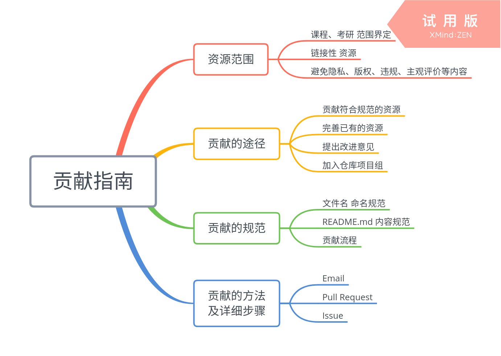

首先感谢各位有意为仓库做出贡献的贡献者们，仓库之建设苟非一日能成，亦非一二人为之；所谓“九层之台，起于垒土；千里之行，始于足下”，仓库资源若能积少成多、由简至臻，全凭各位贡献者的无私劳动，没有你们，便不可能有仓库的未来。

本贡献指南主要分为三大部分：

1. 贡献的途径
2. 贡献的规范
3. 贡献的方法及详细步骤

    Add something just like this ？

# 贡献的途径

为仓库做出贡献主要有以下几种途径：

- 贡献符合规范的资源
- 完善已有的资源
- 提出改进意见
- 加入仓库项目组

## 贡献资源

**资源范围**：仓库当前所规划的资源类型包括：（1）课程复习资料；（2）考研复习资料。

课程复习资料主要包含以下四种类型：

- **复习资料**：包括但不限于各种复习重点、复习心得等复习资料
- **历年试题**：包括但不限于各种期末考试、期中考试等考试资料
- **作业**：包括但不限于各种课堂作业、课后作业等作业资料
- **教材课件**：对于课件，因其并不属于学生难以获取的资源，故在未经著作人许可的情况下，一般情况下不建议上传课件资源；对于教材资源，则应只列举该门课程所推荐教材信息，仅供读者参考，以便读者后续进行教材的借阅、购买等行为，对于已经绝版的资源，或者其销售价格明显超出合理范围的资源，则不受此限

> 考研复习资料类型正在规划中。。。

此外，还有一些特殊情况，对于下面所描述的资源类型，应当只给出资源的链接地址，而非直接上传到仓库中：

- **视频类资源**
- **声明不允许转载的资源**
- **单个文件大小超过 100 MB 的资源**

**隐私问题**：各位贡献者所上传的资料中，应避免包含各类隐私信息，例如电话号码、家庭住址等个人信息。

**主观评价问题**：各位贡献者所上传的资料中，应避免包含各类主观评价问题，包括对课程的评价、老师的评价等。

**版权问题**：请具体参阅[版权声明](./版权声明.md)、[仓库协议](../LICENSE)、[免责声明](./免责声明.md)和[侵权处理](./侵权处理.md)等文件。对版权问题有兴趣的读者，欢迎参阅[版权讨论](./版权讨论.md)文件。

**违规问题**：请各位贡献者务必不要上传无关资源，包括但不限于以下情形：

1. 违反宪法或法律法规规定的；
2. 危害国家安全，泄露国家机密，颠覆国家政权，破坏国家统一的；
3. 损害国家荣誉和利益的，损害公共利益的；
4. 煽动民族仇恨、民族歧视，破坏民族团结的；
5. 破坏国家宗教政策，宣扬邪教和宗教迷信的；
6. 散步谣言，扰乱社会秩序，破坏社会稳定的；
7. 散步淫秽、色情、赌博、暴力、凶杀、恐怖或者教唆犯罪的；
8. 侮辱或者诽谤他人，侵害他人合法权益的；
9. 含有法律、行政法规禁止的其他内容的。

## 完善资源

**资源规范问题**：如果资源存在不规范问题

## 提出改进意见

除了为仓库贡献或改善资源，您还可以为仓库提出改进意见，包括但不限于仓库的各种组织架构、设计细节等问题。您可以通过提交 Issue，提交 Pull Request，或者通过邮件（uestc-course@outlook.com）来提出改进意见。

## 加入仓库项目组

如果您是电子科技大学在读生，且有兴趣加入仓库项目组进行日常维护，请发邮件（uestc-course@outlook.com）与我们联系。

# 贡献的规范

贡献的规范主要包括以下

- 文件名规范
- README.md 文件规范

## 文件名规范

**复习资料**：不作规范，由贡献者自行命名。

**历年试题**：`[考试时间]-[考试类型]-[有无答案]`，示例如下：

> 2019年春-期末考试-有答案
> 
> 2018年秋-期中考试-无答案
> 
> 时间不明-课堂考试-无答案

**作业**：`[作业时间]-[作业类型]`，示例如下：

> 2019年春-课后作业
> 
> 2018年秋-课堂作业-1
> 
> 2018年秋-课堂作业-2

**课件**：`[00]-[章节名]-[0]`，以*中国特色社会主义理论与实践研究*为例：

> 01-导论
>
> 02-中国特色社会主义进入新时代
> 
> 03-新时代中国共产党的历史使命-1
> 
> 04-新时代中国共产党的历史使命-2
> 
> ...

## README.md 文件规范

在每一个课程目录及相应的资源类型文件夹之中，都有一个 README.md 文件，用于描述该文件夹内资源的详细信息。如果读者对 Markdown 文件格式还不熟悉，我们建议您阅读这两篇教程：

- [Mastering Markdown](https://guides.github.com/features/mastering-markdown/)
- [Markdown 语法说明（简体中文版）](https://www.appinn.com/markdown/)

关于 README.md 文件的具体规范，请读者[参阅该文件](./模板/README.md)，里面有各类资源 README.md 的模板文件，读者可以按需复制。

最后，我们建议贡献者按照以下步骤来进行资源贡献：

1. 确定要贡献的资源
2. 确保资源的类型符合仓库所收录的范围
3. 检查该资源在仓库中是否已经存在
4. 检查资源有无隐私内容、违规内容、版权问题等
5. 按照规范修改文件名，添加或修改 README.md 文件信息
6. 选择合适的方法进行贡献

尽管不做强制要求，但是如果您能按照以上步骤进行贡献，则可以极大地减轻项目组的负担。下面介绍具体的贡献方法。

# 贡献的方法及详细步骤

## Email

## Pull Request

## Issue

**再次感谢各位贡献者们，:heart::heart::heart:**
