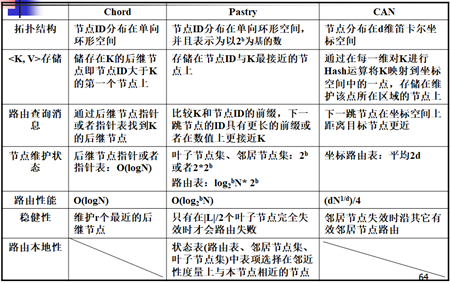
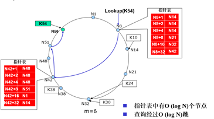

# 网络计算模式复习大纲

1. C/S 架构、B/S 架构、IT 鸿沟、中间件概念
2. 网格概念、五层沙漏模型、OSGA
3. 云计算与网络技术的差别、Map-Reduce、Hadoop 基本原理、数据一致性理论
4. P2P 的概念、DHT 的概念、Chord 算法、Pastry 算法
5. CDN 网络概念、DNS 重定向技术
6. 物联网体系结构

## C/S 架构、B/S 架构、IT 鸿沟、中间件概念

- C/S 架构概念

  C/S 架构是一种典型的两层架构，其全称是 Client/Server，即客户端/服务器端架构，其客户端包含一个或多个在用户的电脑上运行的程序，而服务器端有两种，一种是数据库服务器端，客户端通过数据库连接访问服务器端的数据；另一种是 Socket 服务器端，服务器端的程序通过 Socket 与客户端的程序通信。
  C/S 架构也可以看作是胖客户端架构。因为客户端需要实现绝大多数的业务逻辑和界面展示。这种架构中，作为客户端的部分需要承受很大的压力，因为显示逻辑和事务处理都包含在其中，通过与数据库的交互（通常是 SQL 或存储过程的实现）来达到持久化数据，以此满足实际项目的需要。

- 二层 C/S 结构的优点
  - C/S 体系结构具有强大的数据操作和事务处理能力，模型思想简单，易于人们理解和接受。
  - 系统的客户应用程序和服务器构件分别运行在不同的计算机上，系统中每台服务器都可以适合各构件的要求，这对于硬件和软件的变化显示出极大的适应性和灵活性，而且易于对系统进行扩充和缩小。
  - 在 C/S 体系结构中，系统中的功能构件充分隔离，客户应用程序的开发集中于数据的显示和分析，而数据库服务器的开发则集中于数据的管理，不必在每一个新的应用程序中都要对一个 DBMS 继续编码。将大的应用处理任务分布到许多通过网络连接的低成本计算机上，以节约大量费用。
- 二层 C/S 结构的缺点
  - 开发成本较高
  - 客户端程序设计复杂
  - 信息内容和形式单一
  - 用户界面风格不一，使用繁杂，不利于推广使用
  - 软件移植困难
  - 软件维护和升级困难
  - 新技术不能轻易应用
- 三层 C/S 结构的优点
  - 允许合理地划分三层结构的功能，使之在逻辑上保持相对独立性，能提高系统和软件的可维护性和可扩展性
  - 允许更灵活有效地选用相应的平台和硬件系统，使之在处理负荷能力上与处理特性上分别适应于结构清晰的三层；并且这些平台和各个组成部分可以具有良好的可升级性和开发性。
  - 应用的各层可以并行开发，可以选择各自最适合的开发语言
  - 利用功能层有效地隔离开表示层与数据层，未授权的用户难以绕过功能层而利用数据库工具或黑客手段去非法地访问数据层，为严格的安全管理奠定了坚实的基础。
- 三层 C/S 结构的缺点
  - 三层 C/S 结构各层间的通信效率若不高，即使分配给各层的硬件能力很强，其作为整体来说也达不到所要求的性能。
  - 设计时必须谨慎考虑三层间的通信方法、通信频度及数据量。这和提高各层的独立性一样是三层 C/S 结构的关键问题。
- B/S 架构的全称是 Browser/Server，即浏览器/服务器架构。Browser 指的是 Web 浏览器，只有极少数的事务逻辑在前端实现，主要的事务逻辑在服务器端实现，Browser 客户端，WebApp 服务器端和 DB 端构成所谓的三层架构。B/S 架构的系统无须特别安装，只有 Web 浏览器即可。
- B/S 体系结构的优点
  - 基于 B/S 体系结构的软件，系统安装、修改和维护全在服务器端解决。用户在使用系统时，仅仅需要一个浏览器就可运行全部的模块，真正达到了“零客户端”的功能，很容易在运行时自动升级。
  - B/S 体系结构还提供了异种机、异种网、异种应用服务的联机、联网、统一服务的最现实的开放性基础。
- B/S 体系结构的缺点
  - B/S 体系结构缺乏对动态页面的支持能力，没有集成有效的数据库处理功能
  - B/S 体系结构的系统扩展能力差，安全性难以控制
  - 采用 B/S 体系结构的应用系统，在数据查询等响应速度上，要远远低于 C/S 体系结构
  - B/S 体系结构的数据提交一般以页面为单位，数据的动态交互性不强，不利于在线事务处理应用

- 如何描述 IT 鸿沟？

  
  - IT 鸿沟指的是当业务不断发展的时候，现有的 IT 支持平台的发展不能满足业务的需要，而当 IT 支持平台发展到可以支持业务的需要的时候，业务又有新的需求和发展，这样业务与 IT 支持之间持续存在一个鸿沟。
  - 存在 IT 鸿沟的一个重要的原因就是企业中的信息孤岛问题。信息孤岛指相互之间在功能上不关联互助、信息不共享互换以及信息与业务流程和应用相互脱节的计算机应用系统。

- IT 鸿沟的解决办法

  -  EAI（企业应用集成）。一套完整的 EAI 层次体系包括应用接口层、应用整合层、流程整合层和用户交互层。EAI 使得企业众多信息系统都与一个由中间件组成的底层基础平台相连接，各种“应用孤岛”、“信息孤岛”通过各自的“适配器”连接到一个总线上，然后再通过一个消息队列实现各个应用之间的交流。
  - EAI 技术层次体系最下面的一层是应用接口层，它要解决的是应用集成服务器与被集成系统之间的连接和数据接口的问题。
  - 再往上去就是应用整合层，它要解决的是被集成系统的数据转换问题，通过建立统一的数据模型来实现不同系统间的信息转换。
  - 应用整合层之上是流程整合层，它将不同的应用系统连接在一起，进行协同工作，并提供商业流程管理的相关功能，包括流程设计、监控和规划，实现业务流程的管理。
  - 到了最上端的用户交互层，则是为用户在界面上提供一个统一的信息服务功能入口，通过将内部和外部各种相对分散独立的信息组成一个统一的整体，保证了用户既能够从统一的渠道访问其所需的信息，也可以依据每一个用户的要求来设置和提供个性化的服务。
  - 从用户界面集成、业务流程整合、数据层面集成、应用系统集成四个方面阐述

- 中间件

  - 中间件（Middleware）是一种软件，处于系统软件（操作系统和网络软件）与应用软件之间，它能使处于应用层中的各应用成分之间实现跨网络的协同工作（也就是互操作），这是运行各应用软件之下所涉及的“系统结构、操作系统、通信协议、数据库和其他应用服务”各不相同。
  - 优越性
    - 企业应用方面
    - 存储服务方面
    - 分布式事务服务方面
    - 安全服务
    - 应用程序方面
  - 主流中间件
    - DNA（微软）
    - CORBA
    - J2EE

## 网格概念、五层沙漏模型、OSGA

- 网格计算
  网格计算在每个节点上安装中间件进行彼此之间的连接，使用网格计算的用户需要参与提供计算机资源。网格计算利用互联网上计算机的 CPU 闲置资源处理能力来解决大型计算问题
  
- 优点：提供高效的资源共享服务，平衡多台计算机上的负载，可把程序放到最适合的位置上
  
  - 什么需求出现网格概念
  
- 基本思想

  - 共享：深层次、广泛、动态、具有多种形式的有条件受控的共享
  - 互操作性：共享关系可以跨域不同的平台、语言和编程环境，跨越不同的组织边界、使用策略和资源类型
  - 协议：为了实现特定的操作而定义的分布式系统元素之间交互的方式以及交互过程中交换的信息结构
  - 服务：由所使用的协议和所实现的行为来定义，服务抽象掉了与资源相关的信息

- 五层沙漏模型
  五层结构中各层协议的数量是不同的，对于最核心的协议，既要能实现上层各种协议向核心协议的映射，同时又要能实现核心协议向下层协议的映射，核心协议在所有支持网格计算的地点都应该得到支持，因此核心协议的数量不应该太多，这样核心协议就形成了协议层次结构中的瓶颈，形成沙漏形状。
  
  
  
  
  
  - 构造层：提供网格服务的基础硬件，包括：计算、存储、网络等
  - 连接层：将硬件连接起来，并能方便地查找和使用及为保证使用安全
  - 资源层：将硬件转换成资源，并为资源提供管理和维护功能。有限的资源构成瓶颈
  - 汇集层：将所有单个的资源形成一个网络
  - 应用层：使用资源的用户应用程序
  
- 画出沙漏模型层次图，并解释各层功能
  

  - 中心思想：采用以协议为中心的分层结构

## 云计算与网格技术的差别、Map-Reduce、Hadoop 基本原理、数据一致性理论

- 云计算、网格计算的主要差别
  - 网格计算的思路是聚合分布资源，支持虚拟组织，提供高层次的服务。云计算的资源相对集中，主要以数据中心的形式提供底层资源的使用。
  - 网格计算用聚合资源来支持挑战应用，把要分散的资源聚合起来，后来逐渐强调适应普遍的信息化应用。云计算从一开始就支持广泛企业计算、Web 应用，普适性更强。
  - 网格计算用中间件屏蔽异构系统，力图使用户面向同样的环境，把困难留在中间件，让中间件完成任务。云计算实际上承认异构，用镜像执行或者提供服务的机制来解决异构性的问题。
  - 网格计算用执行作业形式使用，在一个阶段内完成作用产生数据。云计算支持持久服务，用户可以利用云计算作为其部分 IT 基础设施，实现业务的托管和外包。
  - 网格计算更多地面向科研应用，商业模型不清晰。而云计算从诞生开始就是针对企业商业应用，商业模型比较清晰。
  - 云计算是以相对集中的资源，运行分散的应用。网格计算则是聚合分散的资源，支持大型集中式应用。
  - 但从根本上来说，从应对 Internet 的应用的特征特点来说，他们是一致的，为了完成在 Internet 情况下支持应用，解决异构型、资源共享等等问题。

- Map-Reduce
  Map-Reduce 的计算和处理过程，Map 是怎么完成的，Reduce 操作是怎么完成的
  - 目标
    Map-Reduce 的目标是用于大规模数据集（大于 1 TB）的并行运算，在面对节点失效的情况时能够保证大量的文件和数据依然可用。初始化时数据被分割成许多分块的小数据，这些数据都是以 <key, value> 的形式存储。用户程序会分配一个 Master 进程和许多 Worker 进程。
  - 任务分配
    任务开始时，Master 将用户程序的工作分为两种类型的任务（Map 任务和 Reduce 任务），并将这些任务分配给相应的 Workers。
  - Master 的责任
    Master 的责任是给 Map Workers 和 Reduce Workers 分配相应的任务，检测是否有 Workers 进程死掉，将 Map 任务处理后的结果通知给 Reduce 任务。
  - Map worker 的责任
    Map Worker 在得到 Master 的 Map 工作任务的指令后，Map Workers 开始工作。Map Workers 从 input 中获取分块的数据，并通过其中数据存储的方式对数据进行处理，并将处理的中间结果（<key, value> 形成的链表）存放在本地磁盘中。
  - Reduce worker 的责任
    在得到 Master 的有关 Map 处理结果的通知后，Reduce 任务开始工作。Reduce 工人把每个 Map Workers 的本地磁盘中的内容进行整合，形成有序的最终结果，并将结果写入到输出文件中。
    假如一个 Workers 进程失败了，该 Workers 的任务就被分配给其他的 Workers 进程。如果一个 Master 进程失败了，那么整个 Map-Reduce 任务就会终止。
- Hadoop
  - Hadoop 是一个分布式系统基础架构。用户可以充分利用集群的威力进行高速运算和存储。Hadoop 的框架核心的设计就是：HDFS 和 Map Reduce。HDFS 为海量的数据提供了存储，则 Map Reduce 为海量的数据提供了计算。
  - Hadoop 实现了一个分布式文件系统（HDFS）。HDFS 有高容错的特点，部署在低廉硬件上，提供高吞吐量来访问应用程序的数据，适合那些有着超大数据集的应用程序。
- 数据一致性理论中四种同步的方式和机制
  - 强一致性（C）：系统在执行某项操作后仍然处于一致状态。在分布式系统中，更新操作执行成功后所有用户都应该读取到最新的值，这样的系统被认为具有强一致性。
  - 可用性（A）：每一个操作总是能够在一定的时间内返回结果。
  - 分区容错性（P）：分区容错性可以理解为系统在存在网络分区的情况下仍然可以接受请求。
  - CAP 理论是在分布式环境中设计和部署系统时需要考虑的三个重要的系统需求。根据 CAP 理论，数据共享系统只能满足这三个特性中的两个，而不能同时满足三个条件。
    - 放弃 C：放弃数据的强一致性，而保留数据的最终一致性。
    
    - 放弃 A：一旦遇到分区容错故障，那么受到影响的服务需要等待数据一致，因此等待期间系统无法对外提供服务。
    
    - 放弃 P：将数据放在一台机器上，则不会遇到分区带来的负面影响，但会严重影响系统的可扩展性。
    
      

## P2P 的概念、DHT 的概念、Chord 算法、Pastry 算法

- P2P（Peer to Peer）
  P2P对等网络是一种分布式网络，网络的参与者共享他们所拥有的一部分硬件资源（处理能力、存储能力、网络连接能力、打印机等），这些共享资源需要由网络提供服务和内容，能被其它对等节点（Peer）直接访问而无需经过中间实体。在此网络中的参与者既是资源（服务和内容）提供者（Server），又是资源获取者（Client）。

- 三种架构：C/S 架构、纯 Peer 架构、离散哈希表（重点）

- P2P 网络的核心机制，是在应用层建立逻辑上的覆盖网络（overlay network），屏蔽下三层的工作细节

  - 路由和定位
  - 查询和搜索
  - 动态节点算法
  - 容错性

- P2P 网络的优点

  - 提高网络工作效率
    - 对比 C/S 架构，节点间的协作效率更高
    - 结构化 P2P 有严格拓扑结构，基于 DHT，将网络节点、数据对象高效均匀地映射到覆盖网中，路由效率高
  - 充分利用网络带宽
    - P2P 不通过服务器进行信息互换，无服务器瓶颈，无单点失效，充分利用网络带宽，如 BT 下载多个文件，可接近实际最大带宽，而 HTTP 或 FTP 则很少有这样的效果
  - 开发了每个网络节点的潜力
    - 节点资源：计算能力及存储容量
    - 个人计算机并非永久联网，是临时性的动态节点，称为“网络边缘节点”
    - P2P使内容“位于中心”转变为“位于边缘”，计算模式由“服务器集中计算”转变为“分布式协同计算”
  - 具有高可扩展性
  - 良好的容错性
    - 冗余方法：空间换容错
    - 周期性检测：时间换容错（节点自适应状态维护）

- 第二代与第一代的区别：

  1. 没有集中的目录服务器，但是拓扑结构有意义
  2. 使用 DHT 技术，有较好的可伸缩性和查询效率
  3. 使用精准的定位算法和特殊的路由协议使得搜索效率提高
     

- DHT 的概念、主要思想
  
  - Distributed Hash Table，DHT，分布式哈希表
  - 把网络上资源的存取像 Hash Table 一样，可以简单而快速地进行 put、get，该思想的诞生主要是受第一代 P2P（Napster）网络的影响。DHT 更强调的是资源的存取，而不管资源是否是一致的
  - 原理
    - Hash 函数可以根据给定的一段任意长的消息计算出一个固定长度的比特串，通常称为消息摘要（MD，Message Digest），一般用于消息的完整性检验
    - Hash 函数的特性
      - 给定 $P$，易于计算出 $\text{MD}(P)$
      - 只给出 $\text{MD}(P)$，几乎无法找出 $P$
      - 无法找到两条具有同样消息摘要的不同消息
    - Hash 函数
      - MD5：消息摘要长度固定为 128 比特
      - SHA-1：消息摘要长度固定为 160 比特
  - 算法
    - 将内容索引为抽象的键值对
      - 键是内容关键字的哈希摘要
      - 值是存放内容的实际位置，例如 IP 地址等
    - 所有的键值对组成一张巨大的哈希表
    - 每个节点随机生成一个标识（ID），按照特定的映射关系，在应用层上形成一个结构化的重叠网络
    - 给定一个内容的键，则可以根据键与节点 ID 之间的映射关系在重叠网络上找到相应的值（例如 IP 地址）
  
- 基于 DHT 的结构化 P2P 比较

  

  - 目标相同
    - 减少路由到指定文件的 P2P 跳数
    - 减少每个 Peer 必须保持的路由状态
  - 算法异同
    - 都保证算法的跳数与 Peer 群组的大小相关
    - 或都指出算法能以高概率完成
    - 方法上的差别很小

- Chord
  使一个分布式的非集中式的 P2P 查询服务，存储关键字/值对。给定一个关键字（key），将关键字映射到某个节点。如果给对等网络应用的每个数据都分配一个 key，那么对等网络中的数据查找问题就可以用 Chord 很容易地解决了。
  
  - 特点
    
    1. 采用环形拓扑（Chord 环）
    2. 其核心思想就是要解决在 P2P 应用中遇到的基本问题：如何在 P2P 网络中找到存有特定数据的节点
  - 加入过程
  
    - Hash 算法：SHA-1
    - 把节点的 IP 地址表示为 m 位的节点 ID（即 Node ID，NID）
    - 把内容关键字表示为 m 位的 K（即 Key ID，KID）
    - 节点按 ID 从小到大顺序排列在一个逻辑环上
    - 内容，即 KID，存储在数值比它大的下一个节点上，例如 K10 存储在 N11，或者 K20 存储在 N23 上
  
  - 改进前
    
  
    - 每个节点仅维护其后继节点 ID、IP 地址等信息
    - 查询消息通过后继节点指针在圆环上传递
    - 直到查询消息中包含的 $\text{K}$ 落在某节点 ID 和它的后继节点 ID 之间
    - 速度太慢，$\mathbf{O}(N)$，$N$ 为网络中节点数
  
  - 改进后
    
  
    - Chord 中每个节点上都有一张局部的指针表，表中存放 $\log_2 n$ 个节点信息。
  
    - 查询过程
  
      假设当前节点是 $\text{Nc}$，要查找 $\text{Ko}$
  
      - 查找当前节点是否有要查找的 $\text{Ko}$
      - 在指针表里面查找 $\text{Ko}$ 的位置
      - 如果找到，即 $\text{Nc} + 2^i = \text{Ko}, i \in [0, m-1]$，则直接转到对应节点 $\text{Nc + 2^i}$
      - 若没有找到，则查找临界节点
      - 若 $\text{Nc} + 2^i < \text{Ko} < \text{Nc} + 2^{i+1}, i \in [0, m-1]$，转到 $\text{Nc} + 2^i$ 对应的节点处继续查找
      - 若 $\text{Ko} > \text{Nc} + 2^{m-1}$，即最后一项的 $\text{ID} < \text{Ko}$，则在 $\text{Nc} + 2^{m-1}$ 对应节点继续查找，并重复查找当前节点是否有要查找的 $\text{Ko}$
  
    - 节点加入
  
      - 新节点 $N$ 事先直到某个或者某些节点，并且通过这些节点初始化自己的指针表，也就是说，新节点 $N$ 将要求已知的系统中某节点为它查找指针表中的各个表项
      - 在其他节点运行探测协议后，新节点 $N$ 将被反映到相关节点的指针表和后继节点指针中
      - 新节点 $N$ 的第一个后继节点将其维护的小于 $N$ 节点的 ID 的所有 K 交给该节点维护
  
    - 优点
  
      1. 算法简单
      2. 负载平衡：所有的节点以同等的概率分担系统负荷，从而避免某些节点负载过大
      3. 可扩展：查询过程的通信开销和节点维护的状态随着系统总结点数增加成对数关系（$\mathbf{O}(\log N)$ 数量级）
      4. 可用性：要求节点根据网络变化动态更新查询表，能够及时恢复路由关系，使查询可靠地进行
  
    - 缺点：拓扑失配
      
      - 每一跳可能跨越多个自治域，甚至是多个国家的网络
      - 重叠网络与物理网络脱节
      - 实际的寻路延时大
      
    - 改进：提取物理网络的拓扑信息改造 Chord 环（测量 RTT）
  
- Pastry

  - 特点：
    - 考虑网络的本地性，解决物理网络和逻辑网络的拓扑失配问题，即基于应用层定义的邻近性度量，例如 IP 路由跳数、地理距离、往返延时等
    - 节点 ID 分布采用环形结构
    - 每个节点维护一个状态表
      - 路由表，m/b 行，b 的选择反应了路由表大小和路由效率之间的折衷，表中的每项包含节点的 ID、IP 地址等
      - 邻居节点集，存放真实网络中与当前节点最近的 $M$ 个节点的信息
      - 叶子节点集，存放键值空间中与当前节点最近的 $L$ 个节点的信息，路由时，首先检查叶子结点集
  - 算法
  - Hash 算法：SHA-1
    - 把节点的 IP 地址用哈希表示位 m 位节点 ID（即 Node ID，NID）
    - 将内容关键字哈希为 m 位的 K（即 Key ID，KID）
    - NID 和 KID 是以 2b 为基的数，共有 m/b 个数位
    - 键值对存储在离它最接近的节点上
    - 每个节点维护一个状态表：路由表、邻居节点集、叶子结点集
    - 逻辑跳数为 $\mathbf{O}({\log_2 b} N)$

- 哪个算法不存在拓扑识别

## CDN 网络概念、DNS 重定向技术

1. CDN 网络概念
   内容分发网络的目的通过在现有的 Internet 中增加一层新的网络架构，将网站的内容发布到最接近用户的网络“边缘”，使用户可以就近取得所需的内容，解决 Internet 网络拥挤的状况，提供用户访问网站的响应速度。从技术上全面解决由于网络带宽小、用户访问量大、网点分布不均等原因，解决用户访问网站的响应速度慢的根本原因。
   
2. 两种主流的 CDN 网络技术架构
   - Akaimai 和Lime Light
   
     - Akamai 主要使用 DNS 重定向，Lime Light 使用 IP Anycast 技术
   
     - Akamai 在全球建立部署了几千个节点，以物理节点距离用户最近而著称；通过对各节点间的路由优化，实现信息的分发；主要提供 WEB、下载、流媒体等加速服务；
       Lime Light 通过在全球最重要的城市建立“超级节点”，且所有“超级节点”间采用自有光纤直连，实现全球多运营商网络的互联互通；如同在全世界建立了一个自有的、具有互联互通的“BGP”网络；Lime Light 在每个“超级节点”部署了成千上万的服务器、存储、网络设备。形成了分布式的全球“信息”存储中心；通过“超级节点”网络结构的使用，Lime Light 能够更好地满足和支持富媒体全球分布式分发，特别适合于为大资料库、大文件、海量观众提供高效率分发服务。
   
       |          | 对比项               | Akamai                                           | Lime Light           |
       | -------- | -------------------- | ------------------------------------------------ | -------------------- |
       | 基础建设 | 节点数目             | 号称 5000 多个                                   | 22 个                |
       |          | 布点级别             | 二三级节点                                       | 超核心节点           |
       |          | 覆盖策略             | 小节点分布覆盖                                   | 大节点集中覆盖       |
       |          | 节点使用属性         | 租用                                             | 自建                 |
       |          | 边缘节点与源站的距离 | 较远                                             | 较近                 |
       |          | 边缘节点与用户的距离 | 较近                                             | 较远                 |
       | 数据分发 | 小文件分发能力       | 可实现，但受限于各节点之间网络                   | 可实现               |
       |          | 大文件分发能力       | 可基本实现，但全网分发时间较长                   | 可实现，分发时间较快 |
       |          | 分发成本             | 较高                                             | 低                   |
       | 数据存储 | 海量数据存储能力     | 可实现，但受限于存储成本，具有海量存储的节点不多 | 可实现               |
       |          | WEB 数据存储能力     | 可实现                                           | 可实现               |
   
     
   
3. 内容路由的实现机制
   CDN 内容路由，就是为了保证它负载均衡问题，包括 IP anycast 和 DNS 重定向两个技术。

4. DNS 重定向机制的阐述

   1. 用户向域名解析器发送域名解析请求，请求解析某域名，以获取内容服务器的 IP 地址
   2. 域名解析请求中包含了域名解析器的 IP 地址，并被发送到该域名的域名服务器
   3. 该域名的域名服务器通过返回一个 CNAME 类的 DNS 记录，将此域名解析请求重定向到 CDN 网络的域名服务器
   4. CDN 网络的域名服务器对该域名解析请求进行智能解析，根据域名解析器的 IP 地址、网络的拥塞状况、各 CDN 网络边缘节点服务器的负载情况等，将最合适的 CDN 网络边缘节点服务器的 IP 地址返回给域名解析器，域名解析器再转发给用户
   5. 用户直接访问 CDN 边缘节点

## 物联网体系结构

1. 按五层结构阐述示例：感知层、接入层、网络层、中间件层、应用层
   - 感知层由各种传感器以及传感器网关构成，包括二氧化碳浓度传感器、温度传感器、湿度传感器、二维码标签、RFID 标签和读取器、摄像头、GPS 等感知终端。感知层的作用相当于人的眼耳鼻喉和皮肤等神经末梢，它是物联网获识物体、采集信息的来源，主要功能是识别物体、采集信息。
   - 接入层用来读取识别到的物体的信息并将读到的内容连到 Internet。
   - 由各种私有网络、互联网、有线和无线通信网、网络管理系统和云计算平台等组成，负责传递和处理感知层获取的信息。
   - 中间件层：用来管理物联网上的资源和网络通讯，连接多个独立应用程序或独立系统，使它们之间能交换信息
   - 应用层：是物联网和用户（包括人、组织和其他信息）的接口，它与行业需求结合，实现物联网的智能应用
2. 按三层结构阐述：感知层、网络层、应用层
   1. 感知层：包括二维码标签和识读器、RFID 标签和读写器、摄像头、CPS（Cyber Physical Systems，网络化物理系统）、各种传感器、传感器网络（指由大量各类传感器节点组成的自治网络，具有自组织、自愈合的特点）、T2T、H2T、H2H 等终端和传感器网络等，感知层的主要作用时感知和识别物体，采集并捕获信息。
   2. 网络层：包括各种通信网络与互联网形成的融合网络，这被普遍认为时最成熟的部分，除此之外还包括物联网管理中心、信息中心等利用网络的能力对海量信息进行智能处理的部分。也就是说网络层不但要具备网络运营的能力，还要提升信息运营的能力。网络层时物联网成为普遍服务的基础设施。
   3. 应用层：是将物联网技术与行业专业技术相结合，实现广泛智能化应用的解决方案集。物联网通过应用层最终实现信息技术与行业的深度融合，对国民经济和社会发展具有广泛影响。应用层的关键问题在于信息的社会化共享以及信息安全的保障。
3. 主要技术
4. 案例
   1. 牲畜溯源
   2. 精准农业
   3. 机场防入侵
   4. 智能电网
   5. 医疗保健